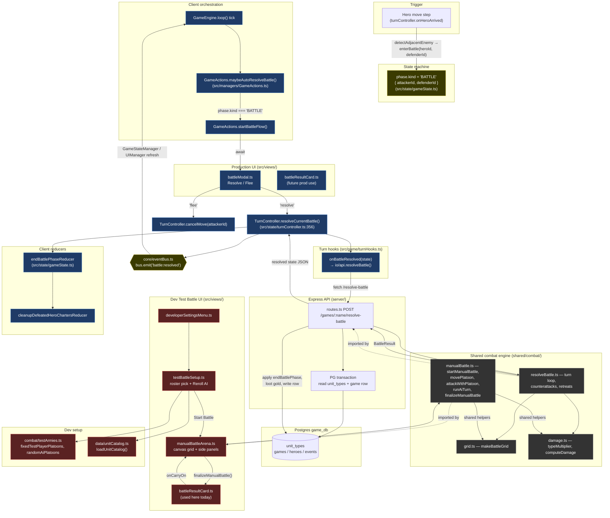

# Battle View Architecture

How a clash between two heroes flows through the UI, the client state
machine, the server resolver, and the shared combat engine. There are
**two entry points** into the battle system that share almost no UI:

1. **Auto-resolve (production)** — the actual game: a hero moves
   adjacent to an enemy, a tiny "Resolve / Flee" modal appears, and
   the server runs `resolveBattle()`.
2. **Test Battle (dev sandbox)** — the manual HoMM3-style arena used
   to exercise `shared/combat/manualBattle.ts`. Reachable only from
   Developer Settings → Test Battle.

The shared `shared/combat/*` engine is the **only module imported by
both** `server/routes.ts` and `src/views/manualBattleArena.ts`
(cross-cutting fact, see `docs/module-documentation-and-relationships.md` §9).

---

## Component map

---

## Two paths side-by-side

### Production — auto-resolve (real game)

1. **Trigger.** `turnController.onHeroArrived` walks the hero along its
   path; each step calls `detectAdjacentEnemyFn(state, hero.id)`. When
   an adjacent enemy hero is found, `enterBattle(attackerId, defenderId)`
   transitions `state.phase.kind` to `BATTLE` (`src/state/turnController.ts:346`).
2. **Detection.** `GameEngine.loop` calls
   `GameActions.maybeAutoResolveBattle()` each tick. If
   `gs.phase.kind === "BATTLE"` and no battle is already in flight, it
   awaits `startBattleFlow()` (`src/managers/GameActions.ts:25`).
3. **User choice.** `startBattleFlow()` opens `showBattleModal()`
   (`src/views/battleModal.ts`) — a centered DOM modal with **Resolve**
   or **Flee**. Fled battles call `tc.cancelMove(attackerId)`;
   resolved battles proceed.
4. **Server call.** `TurnController.resolveCurrentBattle()`
   (`src/state/turnController.ts:356`) calls the injected hook
   `hooks.onBattleResolved(state)` (`src/game/turnHooks.ts` →
   `io/api.resolveBattle()` → `POST /api/games/:name/resolve-battle`).
5. **Server resolve.** Inside a PG transaction (`server/routes.ts:635`)
   the route loads the game row + `unit_types` catalog, normalizes both
   sides' `stacks` into `Platoon[]`, calls `resolveBattleEngine(...)`
   from `shared/combat/resolveBattle.ts`, loots gold if the defender
   lost all troops, writes the updated `heroes` back, and returns the
   new state.
6. **Apply + notify.** The client runs `endBattlePhaseReducer`,
   `cleanupDefeatedHeroChartersReducer` if the defeated hero was
   chartering, and emits `bus.emit({ type: "battle:resolved", ... })`.
   `GameStateManager` + `UIManager` react to refresh visuals.

### Dev — Test Battle (sandbox only)

This is **not** part of the real game flow; it lives behind
Developer Settings so the interactive engine in
`shared/combat/manualBattle.ts` can be exercised end-to-end.

1. `developerSettingsMenu.ts` → "Test Battle" → `openTestBattleSetup()`
   (`src/views/testBattleSetup.ts`). Player roster is fixed
   (`combat/testArmies.ts:fixedTestPlayerPlatoons`); AI roster is
   `randomAiPlatoons()` with a Reroll button. Human picks Blue or Red.
2. "Start Battle" calls `openManualBattleArena(...)`
   (`src/views/manualBattleArena.ts`) — fullscreen canvas, status
   tiles per side, footer action bar, dev console logging on by
   default.
3. Each click routes through the interactive engine
   (`shared/combat/manualBattle.ts`):
   `getMovementRange` → `movePlatoon` → `attackWithPlatoon` /
   `endPlatoonTurn` for the player, `runAiTurn` for the AI.
4. `finalizeManualBattle()` ends the fight → `showBattleResultCard()`
   (`src/views/battleResultCard.ts`). "Carry On" closes the card and
   returns to the setup modal.

---

## Module roles in the battle view surface

| Module | Layer | Role |
|---|---|---|
| `src/state/gameState.ts` | Reducer | `phase.kind === "BATTLE"`, `endBattlePhaseReducer`, `cleanupDefeatedHeroChartersReducer` |
| `src/state/turnController.ts` | Orchestrator | `enterBattle` (line 346), `resolveCurrentBattle` (line 356), `cancelMove` |
| `src/managers/GameActions.ts` | Orchestrator | `maybeAutoResolveBattle`, `startBattleFlow`; gates against re-entry with `battleInFlight` |
| `src/views/battleModal.ts` | UI (DOM) | Resolve/Flee prompt before applying the server result |
| `src/views/battleResultCard.ts` | UI (DOM) | Per-platoon survivors + losses summary; reusable |
| `src/views/manualBattleArena.ts` | UI (canvas+DOM) | HoMM3-style interactive arena (dev only) |
| `src/views/testBattleSetup.ts` | UI (DOM) | Test Battle roster pick (dev only) |
| `src/views/developerSettingsMenu.ts` | UI (DOM) | Entry to Test Battle + Asset Manager |
| `src/combat/testArmies.ts` | Test fixtures | Fixed player + random AI platoons |
| `src/data/unitCatalog.ts` | Catalog cache | `/api/units` loader used by Test Battle |
| `src/game/turnHooks.ts` | Adapter | `onBattleResolved(state)` → `api.resolveBattle` |
| `src/io/api.ts` | Network | Typed `resolveBattle()` fetch wrapper |
| `src/core/eventBus.ts` | Spine | `battle:resolved` event for downstream refresh |
| `shared/combat/grid.ts` | Engine | `makeBattleGrid`, `deploymentPosition` |
| `shared/combat/damage.ts` | Engine | Pure damage math (`typeMultiplier`, `computeDamage`, `applyCasualties`, `applyRetreatLoss`) |
| `shared/combat/resolveBattle.ts` | Engine | Auto-resolver turn loop |
| `shared/combat/manualBattle.ts` | Engine | Interactive turn-by-turn engine |
| `shared/combat/types.ts` | Engine | `BattleResult`, `Combatant`, `BattleSnapshot`, etc. |
| `server/routes.ts` (`POST /resolve-battle`) | Server | Loads DB row + `unit_types`, runs `resolveBattleEngine`, persists result |

---

## Key invariants

- **Server is authoritative for combat math.** Both the production
  flow and the catalog come from the DB row + `unit_types` table;
  the client only orchestrates the user choice and applies the
  returned state. (`turnController.ts:359` comment, `routes.ts:664`).
- **No hero entity is deleted on loss.** A no-retreat loss just
  empties the platoons; capture / ransom / etc. is explicitly out of
  scope (`routes.ts:697`).
- **`battleInFlight` re-entry guard** in `GameActions` prevents the
  modal from being opened twice if the tick fires again before the
  promise resolves (`GameActions.ts:10,37`).
- **Heroes are never deleted server-side from a battle**, only their
  `stacks` are mutated and gold may be looted (`routes.ts:697`).
- **The arena is intentionally dev-only** — `testBattleSetup.ts`
  header comment is explicit that the sandbox skips the auto-resolve
  step of the real battle flow so the arena itself can be exercised
  directly.
