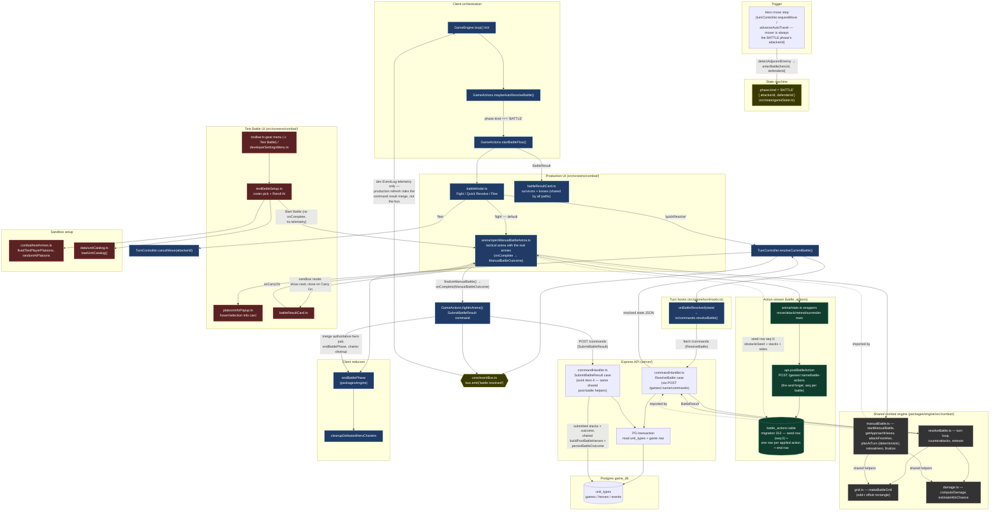

# Battle View Architecture

How a clash between two heroes flows through the UI, the client state
machine, the server resolver, and the shared combat engine. There are
**two entry points** into the battle system that share almost no UI:

1. **Production trigger** — the actual game: a hero moves adjacent to an
   enemy, a **Fight / Quick Resolve / Flee** modal appears, and Fight opens
   the tactical arena with the two heroes' real armies (Quick Resolve falls
   back to the server auto-resolver; both apply the same post-battle rules).
2. **Test Battle (sandbox)** — the manual HoMM3-style arena used to
   exercise `packages/engine/src/combat/manualBattle.ts`. Reachable from the
   toolbar's gear menu (⚔ Test Battle) **and** from Developer Settings;
   identical arena, no `onComplete` callback and no action stream, so it
   never touches real game state.

The shared `packages/engine/src/combat/*` engine is the **only module
imported by both** the server command handler and the client arena
(cross-cutting fact, see `docs/module-documentation-and-relationships.md` §9).

> **Status (2026-09-27).** The manual arena **is wired to the adventure
> map** (plan [`../.kilo/plan/2026-09-27-manual-battle-wiring.md`](../.kilo/plan/2026-09-27-manual-battle-wiring.md)):
> `GameActions.startBattleFlow` opens it as the default collision outcome
> with the phase's real armies and submits the played-out result through the
> `SubmitBattleResult` command; every arena action streams to the
> `battle_actions` table as it happens. Any battle whose **attacker is not
> the local human** quick-resolves — the `maybeAutoResolveBattle` predicate
> keys on the local seat vs. the attacker, so PvP human pairs (2026-09-27)
> and, since the 2026-09-29 AI enemies, AI-vs-AI and AI-attacker-vs-human
> all skip the modal; a client only ever plays its own hero's army in the
> arena. **Morale & fatigue** and **Spellcasting v1**
> shipped the same day — see
> [Combat stats & spellcasting](#combat-stats--spellcasting-shipped-2026-09-27)
> below and their plan docs
> ([morale-fatigue-plan.md](./morale-fatigue-plan.md),
> [spellcasting-plan.md](./spellcasting-plan.md)).

> **On line numbers.** This doc deliberately references **symbols, not
> line numbers**. The original draft cited a dozen exact lines and every
> one of them had drifted within a month.

---

## Component map

```mermaid
flowchart TB
    subgraph TRIGGER["Trigger"]
        A["Hero move step<br/>(turnController.requestMove /<br/>advanceAutoTravel — mover is always<br/>the BATTLE phase's attackerId)"]
    end

    subgraph PHASE["State machine"]
        B["phase.kind = 'BATTLE'<br/>{ attackerId, defenderId }<br/>(src/state/gameState.ts)"]
    end

    subgraph ORCHESTRATION["Client orchestration"]
        C["GameEngine.loop() tick"]
        D["GameActions.maybeAutoResolveBattle()"]
        E["GameActions.startBattleFlow()"]
    end

    subgraph VIEWS_PROD["Production UI (src/screens/combat/)"]
        F["battleModal.ts<br/>Fight / Quick Resolve / Flee"]
        G["battleResultCard.ts<br/>survivors + losses (shared by all paths)"]
        R["arena/openManualBattleArena.ts<br/>tactical arena with the real armies<br/>(onComplete → ManualBattleOutcome)"]
    end

    subgraph STREAM["Action stream (battle_actions)"]
        T1["arena/state.ts wrappers<br/>move/attack/retreat/surrender rows"]
        T2["api.postBattleAction<br/>POST /games/:name/battle-actions<br/>(fire-and-forget, seq per battle)"]
        T3[("battle_actions table<br/>migration 012 — seed row (seq 0) +<br/>one row per applied action + end row")]
    end

    subgraph HOOKS["Turn hooks (src/game/turnHooks.ts)"]
        H["onBattleResolved(state)<br/>→ io/commands.resolveBattle()"]
    end

    subgraph SERVER["Express API (server/)"]
        I["commandHandler.ts<br/>ResolveBattle case<br/>(via POST /games/:name/commands)"]
        I2["commandHandler.ts<br/>SubmitBattleResult case<br/>(work item 4 — same shared<br/>post-battle helpers)"]
        J["PG transaction<br/>read unit_types + game row"]
    end

    subgraph ENGINE["Shared combat engine (packages/engine/src/combat/)"]
        K["grid.ts — makeBattleGrid<br/>(odd-r offset rectangle)"]
        L["damage.ts — computeDamage,<br/>estimateWinChance"]
        M["resolveBattle.ts — turn loop,<br/>counterattacks, retreats"]
        N["manualBattle.ts — startManualBattle,<br/>getApproachHexes, attackFromHex,<br/>planAiTurn (deterministic),<br/>retreatHero, finalize"]
    end

    subgraph DB["Postgres game_db"]
        O[("unit_types<br/>games / heroes / events")]
    end

    subgraph VIEWS_DEV["Test Battle UI (src/screens/combat/)"]
        P["toolbar.ts gear menu (⚔ Test Battle) /<br/>developerSettingsMenu.ts"]
        Q["testBattleSetup.ts<br/>roster pick + Reroll AI"]
        R2["platoonInfoPopup.ts<br/>hover/selection info card"]
        S["battleResultCard.ts"]
    end

    subgraph DEVSETUP["Sandbox setup"]
        T["combat/testArmies.ts<br/>fixedTestPlayerPlatoons, randomAiPlatoons"]
        U["data/unitCatalog.ts<br/>loadUnitCatalog()"]
    end

    subgraph REDUCERS["Client reducers"]
        V["endBattlePhase<br/>(packages/engine)"]
        W["cleanupDefeatedHeroCharters"]
    end

    BUS{{"core/eventBus.ts<br/>bus.emit('battle:resolved')"}}

    %% --- production trigger path ---
    A -->|"detectAdjacentEnemy →<br/>enterBattle(heroId, defenderId)"| B
    C --> D
    D -->|"phase.kind === 'BATTLE'"| E
    E --> F
    F -->|"'fight' — default"| R
    F -->|"'quickResolve'"| X["TurnController.resolveCurrentBattle()"]
    F -->|"'flee'"| Y["TurnController.cancelMove(attackerId)"]
    R -->|"finalizeManualBattle() →<br/>onComplete(ManualBattleOutcome)"| E2["GameActions.fightInArena():<br/>SubmitBattleResult command"]
    E2 -->|"POST /commands<br/>(SubmitBattleResult)"| I2
    X --> H
    H -->|"fetch /commands (ResolveBattle)"| I
    I --> J
    I2 --> J
    J --> O
    I --> M
    M --> K
    M --> L
    M -->|"BattleResult"| I
    I2 -->|"submitted stacks + outcome,<br/>shared buildPostBattleHeroes +<br/>persistBattleOutcome"| O
    I -->|"resolved state JSON"| X
    X --> V
    E2 -->|"merge authoritative hero pair,<br/>endBattlePhase, charter cleanup"| V
    V --> W
    E -->|"BattleResult"| G
    X --> BUS
    E2 --> BUS
    BUS -->|"dev EventLog telemetry only —<br/>production refresh rides the<br/>command result merge, not the bus"| C

    %% --- action stream (Fight path only) ---
    R --> T1
    T1 --> T2
    T2 --> T3
    R -.->|"seed row seq 0:<br/>obstacleSeed + stacks + sides"| T3

    %% --- Test Battle path ---
    P --> Q
    Q --> T
    Q --> U
    Q -->|"Start Battle (no onComplete,<br/>no telemetry)"| R
    R --> R2
    R --> N
    N -->|"shared helpers"| K
    N -->|"shared helpers"| L
    R -->|"sandbox mode:<br/>show card, close on Carry On"| S
    S -->|"onCarryOn"| R

    %% --- shared dependency note ---
    M -.imported by.-> I
    N -.imported by.-> R

    classDef prod fill:#1f3b66,stroke:#3070c0,color:#fff;
    classDef dev fill:#5a2222,stroke:#c04040,color:#fff;
    classDef shared fill:#333,stroke:#888,color:#fff;
    classDef bus fill:#3a3a00,stroke:#d0c040,color:#fff;
    classDef stream fill:#0f3d2e,stroke:#3ba272,color:#fff;
    class F,G,C,D,E,R,E2,X,Y,V,W,H prod;
    class P,Q,R2,S,T,U dev;
    class K,L,M,N shared;
    class B,BUS bus;
    class T1,T2,T3 stream;
```

---

## Two paths side-by-side

### Production — collision outcome (real game)

1. **Trigger.** `turnController.requestMove` (and
   `advanceAutoTravel`) walks the hero along its path; each step calls
   `detectAdjacentEnemyFn(state, hero.id)`. When an adjacent enemy hero is
   found, `enterBattle(attackerId, defenderId)` transitions
   `state.phase.kind` to `BATTLE`. The **mover is always the attacker** —
   a BATTLE phase where the local player's hero is the defender is the
   "enemy moved onto me" case.
2. **Detection.** `GameEngine.loop` calls
   `GameActions.maybeAutoResolveBattle()` each tick. If
   `gs.phase.kind === "BATTLE"` and no battle is already in flight, it
   kicks off `startBattleFlow()`.
3. **User choice.** `startBattleFlow()` opens `showBattleModal()`
   (`src/screens/combat/battleModal.ts`) — **Fight** (primary, the tactical
   arena), **Quick Resolve** (the server auto-resolver), or **Flee** (cancels
   the attacker's move via `tc.cancelMove(attackerId)`). Collisions whose
   attacker is not the local human skip the modal and quick-resolve —
   PvP human pairs, and since the 2026-09-29 AI enemies also AI-vs-AI and
   AI-attacker-vs-human (auto-resolved silently; the result card still
   shows). A human attacker keeps the modal, including against an AI.
4. **Fight path.** `GameActions.fightInArena()` loads the unit catalog,
   opens `openManualBattleArena(...)` with the two heroes' real stacks and
   the local player in their phase role, and awaits the played-out
   `ManualBattleOutcome` via the arena's `onComplete`. The arena stays open
   under the result card; the caller closes it via the returned
   `{ close }` handle on Carry On.
5. **Action stream (4b).** While the fight plays out, every applied action
   posts a `battle_actions` row through `api.postBattleAction` —
   `POST /api/games/:name/battle-actions`, telemetry-style
   (fire-and-forget; a dropped row never blocks or fails the arena). The
   seed row (`seq 0`) carries the obstacle seed + initial stacks + sides;
   `arena/state.ts`'s wrappers stream move/attack/retreat/surrender; the
   terminal `end` row carries outcome + survivors. The engine's AI
   (`planAiTurn`) is deterministic — no AI action rows are needed.
6. **Submit.** The outcome goes back through
   `io/commands.submitBattleResult()` (`SubmitBattleResult`, the 15th
   command kind): submitted survivor stacks per side, the outcome
   (`attackerWon` / `defenderWon` / `retreat` / `surrender` / `draw`), the
   gold actually paid to surrender, and the arena's rounds + obstacle seed.
7. **Server apply.** The `commandHandler.ts` `SubmitBattleResult` case
   re-derives the live-collision precondition (adjacency — the server never
   persists a BATTLE phase), validates survivor unit ids against the same
   catalog the auto-resolver uses, then runs the **same shared post-battle
   helpers** as `ResolveBattle` (`buildPostBattleHeroes` +
   `applyHeroBattleOutcomes` + `persistBattleOutcome`): loot-on-wipe
   (purse + cargo, wagon-capped), per-side hero verdicts applied — defeat
   **deletes** the hero from the record and prunes their owner's `heroIds`;
   retreat/surrender relocate to the nearest owned settlement (none → the
   hero stays at its cancelled position, plan edge D1) — charter cleanup
   for **every removed hero** (attacker included), legacy-gold accounting,
   granular dual-write, players persisted on every outcome (so the
   `heroIds` prune can't dangle). Retreat and surrender additionally cancel
   the attacker's move server-side (`cancelMove`) before relocation
   overwrites the restored position; surrender debits the conceding hero's
   purse (validated against it first). A `BattleResolved` event is emitted
   on every path, now carrying optional per-side verdicts
   (`HeroBattleVerdict`: `defeated`/`retreated`/`surrendered`/`stood`) —
   the outcome enum still collapses retreat and surrender both onto
   `retreated_hero`, so the verdict field is the only thing that
   discriminates them (plan edge D5).
8. **Apply + notify.** The client merges the authoritative hero pair —
   an **absent** hero now means delete (`mergeBattleOutcomeHeroes` in
   `src/game/turnHooks.ts`: drop the local row, prune `heroIds`, clear a
   selection pointing at it) —
   runs `endBattlePhase` + `cleanupDefeatedHeroCharters` (mirroring
   `resolveCurrentBattle()`), shows the shared result card with real hero
   labels and per-side verdict lines (`battleResultText.ts`: "slain" /
   "retreated to \<name\>" / "surrendered to \<name\>"), and emits
   `bus.emit({ type: "battle:resolved", ... })` — dev-log telemetry only
   (the EventLog whitelist); the card/toast data comes from the command
   return values, not the bus.
9. **Quick Resolve path.** Unchanged from before the wiring:
   `TurnController.resolveCurrentBattle()` →
   `hooks.onBattleResolved(state)` (`src/game/turnHooks.ts` →
   `io/commands.resolveBattle()` → `POST /api/games/:name/commands`,
   `ResolveBattle` command) → server runs
   `resolveBattleEngine(...)` inside a PG transaction, loots the wiped
   defender, applies the same hero outcomes as step 7 (a defeated hero is
   absent from the returned record; retreat/surrender can't occur here —
   the auto-resolver is run with no retreat policies), and returns the new
   state + `BattleResult`. Same shared post-battle helpers as step 7.

### Test Battle (sandbox)

This is **not** part of the real game flow: it exists so the interactive
engine in `packages/engine/src/combat/manualBattle.ts` can be exercised
end-to-end without an adventure-map collision. The sandbox passes neither
`onComplete` nor `telemetry`, so it never touches real game state and
streams nothing.

1. **Entry.** `toolbar.ts`'s gear dropdown ("⚔ Test Battle" menu item,
   titled *"Sandbox: player vs AI manual-fight arena (no effect on your real
   game)"*; moved out of the main button row by the 2026-09-29 playtest
   fixes) or `developerSettingsMenu.ts` → `openTestBattleSetup()`
   (`src/screens/combat/testBattleSetup.ts`). Player roster is fixed
   (`testArmies.fixedTestPlayerPlatoons`); AI roster is
   `randomAiPlatoons(unitTypes)` with a Reroll button. Human picks Blue
   or Red.
2. **Start.** "Start Battle" calls
   `openManualBattleArena(playerPlatoons, aiPlatoons, unitTypes, humanSide)`.
   Engine roles are fixed to grid colors (attacker always blue, defender
   always red); `humanSide` picks which role the player controls, and
   `sideChoice` deploys the human on the grid's left edge regardless of
   role. `options.heroGold` defaults to 300 so the sandbox always
   exercises the Surrender "Leave Behind" path.
3. **Play.** Each click routes through
   `packages/engine/src/combat/manualBattle.ts`: `getMovementRange` →
   `movePlatoon` / `attackWithPlatoon` / `attackFromHex` / `endPlatoonTurn`
   for the player, `planAiTurn` for the AI. Hovering a platoon raises
   `platoonInfoPopup.ts` with its stats, and hovering an enemy adds a
   win-odds estimate (`damage.estimateWinChance`) against your selected
   platoon.
4. **Finish.** `finalizeManualBattle()` ends the fight →
   `showBattleResultCard()`. "Carry On" closes the card and returns to
   the setup modal. **Retreat** and **Surrender** exit early via
   `retreatHero` (with and without loss respectively).

---

## The arena UI

`manualBattleArena.ts` is a **battlefield-first three-band layout** —
status bar / battle row / action + log bar:

- **Grid.** Hex size is *solved for the available box* rather than drawn
  at a fixed size and scaled down, and the canvas is 1:1 with its layout
  box over a device-pixel backing store. `makeBattleGrid` emits cells in
  **odd-r offset** coordinates so the pointy-top mapping yields a true
  rectangle instead of a rhombus.
- **Roster rails.** 190px columns of ~33px platoon strips (specialty
  icon, count, HP bar); spent platoons dim. Per-platoon stats live in the
  hover/selection info card, not on the tiles.
- **Approach-hex targeting.** Hovering a reachable enemy latches it and
  reads the approach hex off whichever sixth of its hex the cursor sits
  in (`core/hex.nearestHexEdge`), drawn with a direction arrow. A sector
  pointing at a blocked or unreachable hex snaps to the nearest legal
  side. The latch survives the cursor moving onto one of the approach
  hexes, so clicking that hex directly also works. **Melee only** —
  ranged platoons shoot from where they stand and get their own help text.
  Attack range is **per platoon**: `platoonRange` takes the minimum
  per-unit `range` stat across the platoon's entries (catalog-driven;
  `unit_types.range` since migration 015), replacing the old flat
  `RANGED_ATTACK_RANGE` constant.
- **AI turn.** Stepped on a timer — telegraph the acting platoon with a
  white ring (~320ms), then resolve and repaint (~260ms) — rather than
  resolved synchronously in one repaint.
- **Player moves glide the same beat** (2026-10-04): the arena replays the
  engine walk (`getMovementPath`) hex-by-hex through the same `moveAnim`
  cosmetic the AI uses, defers the post-move continuation (bump attack /
  hand-off) until arrival, and gates input while gliding (mirroring the
  AI-acting gate). Pace is the shared `arenaMoveMsPerHex` setting
  (0 = instant, uncapped for the player; the AI keeps its 620 ms cap).
- **Battle log.** The engine's log is surfaced in the footer, collapsed
  to one line and expandable. It previously only reached `console.log`.

---

## Combat stats & spellcasting (shipped 2026-09-27)

Two features layered onto the engine's extension seams — neither changes
the alternating-turn loop's shape.

### Morale & fatigue

Every `Combatant` carries live `morale` (starts 100) and `fatigue`
(starts 0):

- **Fatigue** accrues +6 per move and +15 per attack (counterattacks
  included — the accrual lives in `resolveAttack`, the seam shared by
  both engines) and decays −5 at each own-turn start. It scales
  `effAttack` **and** `effDefense` linearly down to 0.65× at fatigue
  100, in `damage.ts` next to the existing `typeMultiplier` step.
- **Morale** drops −2 per casualty and −10 when an adjacent same-side
  platoon dies; kills grant +10. It is attack-only: a linear penalty
  down to 0.7× at morale 0 (defense is discipline, not spirit).
- **Low morale (< 30) makes a platoon rout EARLIER**: the `auto`
  retreat policy's self-retreat HP threshold rises by 0.15 (owner
  decision 2026-09-27, overriding the plan's literal "lowers the
  threshold" wording).
- Every mutation emits a `morale_change` `BattleLogEntry` carrying
  deltas + resulting values, so battle state is fully determined by the
  log (the future legality-check consumer re-derives it). The arena's
  roster rail, info popup, and battle scene render the real values —
  the hard-coded 100/0 placeholder bars are gone.
- All tunables are named constants in `packages/engine/src/combatConfig.ts`
  (owner-tunable; values listed in
  [morale-fatigue-plan.md](./morale-fatigue-plan.md) §As built).

### Spellcasting v1

A hero-level action layered on top of the turn loop (never consumes a
platoon's turn — the same out-of-band pattern the removed Spy action
used):

- **Persistent identity.** `HeroState` carries `arcane`,
  `intelligence`, `heroMana`, `heroMaxMana`, and `heroSpell` (one
  spell per hero for v1; every hero gets Magic Arrow by default).
  Persisted in the games-row state JSONB with a read-path backfill —
  no migration. The hero info panel's four stat rows show the real
  values.
- **Formulas** (constants in `combatConfig.ts`): pool =
  `intelligence × MANA_PER_INTELLIGENCE (10)`; Magic Arrow deals
  `arcane × SPELL_POWER_PER_ARCANE (5)` **flat** damage through
  `applyCasualties()` (skips the atk/def ratio and type multiplier);
  Bless applies a ×1.5 attack buff to one friendly platoon for 3
  rounds via the per-`Combatant` `activeEffects` list (expired
  entries are pruned at round advance). Casting costs
  `SPELL_MANA_COST = 10` and is limited by mana only.
- **Cast flow.** The hero panel's Cast button enables when mana
  suffices; clicking enters `castMode`, living valid targets get a
  violet ring (both the legacy canvas and the scenebuilder draw paths),
  and a click on one resolves immediately — before the normal
  select/attack/move chain in `handleClick`, so it can't be misread.
- **Mana economy.** The pool persists across battles in `HeroState`;
  the server refills it fully on the overworld day tick
  (`advanceRound()` in `packages/engine/src/turn/round.ts` — the actual
  day-increment seam). Battle-internal spending does not write back
  mid-fight; the next day tick restores the pool.
- **AI never casts in v1** (v1.1 fast-follow); the AI-side cast button
  is not rendered.
- **Streaming.** Every cast posts a `battle_actions` row with
  `phase: "spell"` through the same telemetry wrappers as
  move/attack/retreat — the action log stays complete for the future
  legality-check consumer.

---

## Module roles in the battle view surface

| Module | Layer | Role |
|---|---|---|
| `src/state/gameState.ts` | Reducer | `phase.kind === "BATTLE"`; re-exports the engine's `endBattlePhase` / `cleanupDefeatedHeroCharters` |
| `src/state/turnController.ts` | Orchestrator | `enterBattle` (mover = attacker), `resolveCurrentBattle` (Quick Resolve), `cancelMove` (Flee) |
| `src/managers/GameActions.ts` | Orchestrator | `maybeAutoResolveBattle`, `startBattleFlow`, `fightInArena` (Fight path: arena → `SubmitBattleResult` → merge → end phase); gates re-entry with `battleInFlight` |
| `src/screens/combat/battleModal.ts` | UI (DOM) | Fight / Quick Resolve / Flee prompt before anything is resolved |
| `src/screens/combat/battleResultCard.ts` | UI (DOM) | Per-platoon survivors + losses summary — used by **both** paths; renders the per-side verdict lines from `battleResultText.ts` under the winner banner |
| `src/screens/combat/battleResultText.ts` | UI (pure) | Verdict wording (2026-09-29 hero outcomes): `battleVerdictCardLine` / `battleVerdictToastPhrase` / `battleToastMessage` / `settlementNameAt` — "slain" / "retreated to \<name\>" / "surrendered to \<name\>"; an absent verdict (pre-W1 server) renders nothing |
| `src/screens/combat/arena/openManualBattleArena.ts` | UI (canvas+DOM) | HoMM3-style interactive arena; production callers get `onComplete` (outcome) + `telemetry` (action stream) and a `{ close }` handle |
| `src/screens/combat/arena/state.ts` | Arena wrappers | Thin wrappers over the engine's apply-functions; stream one `battle_actions` row per applied action (`safeEmit` guard — telemetry can never fail the arena). `moveSelectedTo` returns the walk `path` in `MoveResult`, which the arena glides the player's platoon along (paced by the shared `arenaMoveMsPerHex` setting) |
| `src/screens/combat/arena/ai.ts` | Arena AI | `createArenaAi` → engine `planAiTurn` (deterministic — no AI action rows needed); walk beat paced by the shared `arenaMoveMsPerHex` setting under a 620 ms cap (the `AI_MOVE_MS_PER_HEX` constant was removed) |
| `src/screens/combat/platoonInfoPopup.ts` | UI (DOM) | Hover/selection info card; win-odds vs. your selected platoon |
| `src/screens/combat/testBattleSetup.ts` | UI (DOM) | Test Battle roster pick (sandbox — no `onComplete`, no telemetry) |
| `src/screens/shared/toolbar.ts` | UI (DOM) | "Test Battle" entry — a gear-dropdown menu item (⚔ Test Battle, 2026-09-29; no longer a main-row button) |
| `src/screens/combat/developerSettingsMenu.ts` | UI (DOM) | Alternate Test Battle entry + Asset Manager |
| `src/combat/testArmies.ts` | Fixtures | `fixedTestPlayerPlatoons()`, `randomAiPlatoons(unitTypes)` |
| `src/data/unitCatalog.ts` | Catalog cache | `/api/units` loader used by the arena and Test Battle |
| `src/core/hex.ts` | Geometry | `HEX_DIRECTIONS`, `nearestHexEdge` — canonical direction math |
| `src/game/turnHooks.ts` | Adapter | `onBattleResolved(state)` → `io/commands.resolveBattle` (Quick Resolve path) |
| `src/io/commands.ts` | Network | `resolveBattle()` + `submitBattleResult()` (`SubmitBattleResult`) POST wrappers |
| `src/io/api.ts` | Network | `postBattleAction` — fire-and-forget `battle_actions` POST (short timeout, swallows failures) |
| `src/core/eventBus.ts` | Telemetry | `battle:resolved` emission is dev-log telemetry only (EventLog whitelist); production result cards/toasts consume command return data + `consumeResolveBattleVerdicts`, not the bus |
| `packages/engine/src/combat/grid.ts` | Engine | `makeBattleGrid` (odd-r offset), `deploymentPosition`, `columnOf` |
| `packages/engine/src/combat/damage.ts` | Engine | Damage math (attacker fatigue/morale scale `effAttack`, defender fatigue scales `effDefense`) + `totalHealth` / `estimateWinChance` estimators |
| `packages/engine/src/combat/resolveBattle.ts` | Engine | Auto-resolver turn loop; `resolveAttack` (the shared fatigue/morale seam), `effectiveSelfRetreatHpPct` (low morale routs earlier) |
| `packages/engine/src/combat/manualBattle.ts` | Engine | Interactive engine; `platoonRange` (min per-unit `range` stat across the platoon's entries — the single source of attack-range truth), `getApproachHexes`, `attackFromHex`, `castSpell`, `getValidSpellTargets`, `planAiTurn`, `retreatHero`, `finalizeManualBattle`, `timeOfDayForRound` |
| `packages/engine/src/combat/spells.ts` | Engine | Spell catalog (Magic Arrow, Bless), `maxManaFor`/`spellDamageFor`, `regenerateHeroMana` (day-tick refill), `activeEffectMultiplier`/`pruneExpiredEffects`, `spellLoadoutForHero` backfill |
| `packages/engine/src/combat/types.ts` | Engine | `BattleResult`, `Combatant` (incl. `morale`/`fatigue`/`activeEffects`), `CombatEffect` (`damage`/`spell_damage`/`spell_buff`), `BattleLogEntry` (incl. `morale_change`/`spell_cast`), `BattleSnapshot` |
| `packages/engine/src/combatConfig.ts` | Engine | All combat tunables: type advantage, retreat loss, the morale/fatigue block, spell costs/power/buff duration |
| `packages/contracts/src/commands/submitBattleResult.ts` | Contracts | The 15th command kind: submitted outcome + survivor stacks + rounds/obstacleSeed |
| `server/app/commandHandler.ts` (`ResolveBattle` + `SubmitBattleResult` via `POST /games/:name/commands`) | Server | Loads DB row + `unit_types`; runs `resolveBattleEngine` or applies the submitted outcome — both through the shared `buildPostBattleHeroes`/`applyHeroBattleOutcomes`/`persistBattleOutcome` helpers (verdict application: defeat deletes the hero, retreat/surrender relocate; plan `2026-09-29-hero-outcomes.md`) |
| `packages/engine/src/combat/battleOutcome.ts` | Engine (pure) | `deriveHeroVerdict(sideOutcome, conceded?)` → `defeated`/`retreated`/`surrendered`/`stood`; `nearestOwnedSettlement` (hexDistance min; null when the owner holds nothing — the D1 stay-put edge); `relocateHeroToSettlement` (q/r set, previous*/trail reset) |
| `server/http/routes/battleActions.ts` | Server | `POST /games/:name/battle-actions` — telemetry-style insert into `battle_actions` (seat stamped from the session) |
| `server/migrations/012_battle_actions.sql` | Schema | `battle_actions` table + per-battle replay index |

---

## Key invariants

- **Server is authoritative for combat math.** The unit catalog and the
  auto-resolver come from the DB row + `unit_types` table; the client only
  orchestrates the choice and applies returned state. For the Fight path
  the played-out outcome is **trusted** (v1 LAN-trust decision, plan
  2026-09-27), but the server still validates it structurally (adjacency
  re-derivation, survivor unit ids against the catalog, surrender gold ≤
  purse) and the full per-action stream lands in `battle_actions` for the
  future legality-check consumer.
- **Defeat deletes the hero.** (Rewritten 2026-09-29 — this used to say
  "no hero entity is deleted on loss".) A side wiped to zero troops
  (`lost_all_troops`) is removed from the heroes record, pruned from their
  owner's `heroIds`, and their `hero_platoons` rows swept (`heroRepo`'s
  NOT-IN cleanup); winner-takes-loot and charter cleanup apply to every
  removed hero. The auto path never passes retreat policies, so
  AI-involved losers are always removals. The capture/ransom plan stays
  out of scope, superseded by these outcomes.
- **`battleInFlight` re-entry guard** in `GameActions` prevents the modal
  being opened twice if the tick fires again before the promise resolves —
  and it now stays set for the whole arena session, so nothing can
  auto-resolve underneath a fight that's being played out. It is cleared in
  a `finally`, so a throw mid-flow cannot wedge it.
- **The two resolvers apply identical world rules.** `resolveBattle.ts` is
  the auto path, `manualBattle.ts` the played-out path; both server-side
  applications run the same shared helpers (`buildPostBattleHeroes` /
  `applyHeroBattleOutcomes` / `persistBattleOutcome` in
  `server/app/commandHandler.ts`) so loot, survivor stacks, verdicts
  (defeat removal, retreat/surrender relocation), charter cleanup, and
  event emission cannot drift between them.
- **Retreat/surrender cancel the attacker's move, then relocate.** Both
  client (`tc.cancelMove`) and server (`cancelMove` on the submitted
  command) restore the mover's pre-collision position — decision 3 of the
  wiring plan — and the server's `applyHeroBattleOutcomes` then relocates
  the conceder to the nearest settlement their owner holds (retreat with
  stacks zeroed, surrender keeping them); with none owned, the hero
  remains at the cancelled position (2026-09-29 hero outcomes, plan edge
  D1).
- **The two engines never mix.** `resolveBattle.ts` is the only resolver
  the server imports; `manualBattle.ts` is only ever driven from the
  client arena. `manualBattle` imports `resolveBattle` for shared
  helpers (`pickTarget`), not the other way around.
- **Approach-hex selection is melee-only.** `getApproachHexes` and
  `attackFromHex` reject ranged actors (any platoon with `platoonRange`
  > 1); ranged platoons attack from where they stand, within their
  per-unit `range` (min across the platoon's entries).
- **`attackFromHex` validates before it moves.** Everything is checked
  up front, so a rejected move-and-attack can never leave a platoon
  half-committed.
- **No fog of war in battle.** The Spy action and its
  `scoutedBy`/`markContacted` fog were removed as half-baked — every
  platoon is visible to both sides. The parked idea is written up in
   [`../.kilo/plan/2026-08-15-combat-reveal-fog-of-war.md`](../.kilo/plan/2026-08-15-combat-reveal-fog-of-war.md).
- **Casting never consumes a platoon's turn.** `castSpell` deducts hero
  mana and applies its effect without touching the `unacted` sets or the
  round counter — spellcasting is an out-of-band hero action.
- **The AI never casts (v1).** The AI-side cast button is not rendered
  and `planAiTurn` has no casting branch; AI casting is a v1.1
  fast-follow.
- **Morale/fatigue are fully log-determined.** Every morale/fatigue
  mutation emits a `morale_change` entry with deltas + resulting values,
  and every spell cast emits `spell_cast` — the `battle_actions` stream
  plus the log re-derive battle state, which is what the future
  legality-check consumer will re-simulate against.
