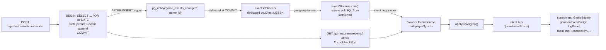

# Event System

**Status:** Describes the current implemented state of the project's event-driven system — the Postgres-backed event log, the LISTEN/NOTIFY → SSE streaming path, the client ingestion layer, the client event bus, and a complete inventory of every event consumer. Written 2026-09-30; organization pass same day. Companion to [./architecture.md](./architecture.md) (module layout) and [../src/render/docs/technical-spec.md](../src/render/docs/technical-spec.md) (render layer).

## Context

Every state mutation in a multiplayer game is recorded as a row in the `game_events` table. That table is simultaneously:

- the **sync log** remote browsers replay to converge on the server's state (the event-cursor design, plan `.kilo/plan/2026-08-16-phase-3-parallel-dev-plan.md` Phase 5.A / `2026-09-28-sse-event-push.md`),
- the **audit trail** (legacy snake_case kinds ride the same table), and
- the **push source** for the SSE stream that replaced poll-only sync.

The pipeline, end to end:



The table stays the system of record. Notifications carry only a `game_id`; every consumer re-SELECTs rows after its own cursor with the same query, so the notification is a wakeup, never data.

## 1. Storage

### 1.1 `game_events` DDL

Base table in `server/schema.sql:23-31`; migrations extend it:

```sql
CREATE TABLE IF NOT EXISTS game_events (
  id BIGSERIAL PRIMARY KEY,                                   -- the event cursor
  game_id INTEGER NOT NULL REFERENCES games(id) ON DELETE CASCADE,
  kind TEXT NOT NULL,
  payload JSONB NOT NULL DEFAULT '{}'::jsonb,
  created_at TIMESTAMPTZ NOT NULL DEFAULT now()
);
CREATE INDEX IF NOT EXISTS game_events_game_id_idx ON game_events(game_id);
```

| Migration | Adds |
|---|---|
| `server/migrations/010_event_seq.sql` | Nullable `actor_seat INTEGER` (null when an event is not attributable to one seat: `round_started`, `ai_turn_started`, `turn_skipped`, legacy `POST /events` rows) + `game_events_actor_idx ON game_events(game_id, actor_seat)`. |
| `server/migrations/017_game_events_notify.sql` | The AFTER INSERT trigger → `pg_notify('game_events_changed', NEW.game_id::text)` (§3.1). |
| `server/migrations/019_game_events_game_id_id_idx.sql` | Composite cursor index `game_events_game_id_id_idx ON game_events(game_id, id)` — turns the cursor query into an index-ordered range scan (§1.1). |

`id` is a strictly monotonic BIGSERIAL, so it doubles as the cursor (`?after=<id>`) with no separate sequence column. Over the wire it is a string (node-postgres hands `int8` back as a string to avoid precision loss above 2^53); clients `Number()` it.

The cursor query (`WHERE game_id = $1 AND id > $2 ORDER BY id ASC`) runs as an index-ordered range scan over the composite `(game_id, id)` index added by migration 019 (`CREATE INDEX IF NOT EXISTS`, so it re-runs as a no-op at every boot). The composite subsumes the older `game_events_game_id_idx`, which is kept for now; dropping it is a future cleanup.

### 1.2 Cursor seeding

`GET /api/games/:name` returns `last_event_id` computed **in the same statement** as the game row (`server/routes.ts:202-215`), so no event can slip between the snapshot and the cursor that labels it:

```sql
SELECT ${GAME_COLUMNS},
       COALESCE((SELECT MAX(e.id) FROM game_events e WHERE e.game_id = games.id), 0)::text
         AS last_event_id
FROM games WHERE name = $1
```

`src/managers/GameSessionManager.ts:86-87` seeds `MultiplayerSync.start()` with it. A create-game response carries no `last_event_id`, so a fresh unclaimed game leaves the cursor `null` and the sync's first tick does its own full hydrate (§4.3).

## 2. Producers

### 2.1 The command path (primary writer)

`eventRepo.append(gameName, kind, payload, actorSeat)` (`server/persistence/repositories/eventRepo.ts`) resolves the FK'd `game_id` from the game name in the same INSERT:

```sql
INSERT INTO game_events (game_id, kind, payload, actor_seat)
SELECT id, $2, $3::jsonb, $4 FROM games WHERE name = $1
RETURNING id
```

Returns the inserted row's id so the caller can report its cursor position. `0` is the "nothing inserted" sentinel (the `SELECT` subquery inserts zero rows for a missing game name rather than erroring; BIGSERIAL starts at 1, so 0 is unambiguous).

`server/app/commandHandler.ts` appends **~once per successful command**: `kind` = the EngineEvent's `type` (e.g. `HeroMoved`), `payload` = the whole event verbatim, `actor_seat` = the command's actor. Each command case follows the same template (e.g. `Move` at `commandHandler.ts:570`):

```ts
const lastEventId = await deps.eventRepo.append(command.gameName, event.type, event, command.actor);
return { ok: true, events: [event], lastEventId, ... };
```

The append runs in the **same transaction** as the state persist: `handleCommandTransactional` (`commandHandler.ts:1902-1935`) takes a `PoolClient` per request, issues `SELECT id FROM games WHERE name = $1 FOR UPDATE` (pessimistic serialization of concurrent commands), then runs the handler — save + append — on that one client. Either both land or neither.

`lastEventId` rides the command response (`CommandResult.lastEventId`, `commandHandler.ts:158`); the issuing client records it via `MultiplayerSync.noteSelfEventId()` so its own writes are skipped on the wire (§4.2).

### 2.2 EndTurn's extra audit kinds

The `EndTurn` case appends `TurnEnded` **plus** the legacy snake_case audit kinds the old `/end-turn` route wrote, preserving the historical trail shape (`commandHandler.ts:689-714`):

| Kind | When | actor_seat |
|---|---|---|
| `turn_ended` | every EndTurn | actor |
| `round_ended` | round wrapped | actor |
| `round_started` | round wrapped | **null** (not seat-attributable) |
| `ai_turn_started` | next active player is AI | **null** |

`lastEventId` is reassigned through each append so it ends at the highest id the command caused.

### 2.3 Drop-policy `turn_skipped`

`runServerEndTurnForSeat` (`commandHandler.ts:1985-2005`) reuses the full EndTurn pipeline for a disconnected seat whose grace expired, then appends one extra `turn_skipped` audit row (actor_seat null). This append is deliberately **outside** the command transaction and best-effort — a failed audit append must not roll back an already-committed turn.

### 2.4 Legacy and client writers

The log is **not solely server-authored**:

- `POST /api/games/:name/events` (`server/routes.ts:482-510`) accepts any `kind` matching `^[a-z0-9_]{1,64}$` (400 `invalid kind` otherwise) with a JSON payload capped at 8192 chars (400 `payload too large`) — both validated before the game 404 — and still requires no auth: anonymous audit writes are the documented design. Response shape unchanged (`{ id, kind, payload, created_at }`); `src/io/api.ts`'s `logEvent` wraps it.
- Clients post audit kinds through `api.logEvent`:
  - `GameSessionManager`: `new_game` (:135), `load_game` (:73), `session_start` (:175);
  - `TurnController` hooks (`hooks.logEvent` → `turnHooks.ts:498-511` → `api.logEvent`): `battle_started`, `battle_resolved`, `settlement_captured`, `settlement_battle_started`, `settlement_battle_unresolved`, `settlement_battle_resolved`, `settlement_battle_cancelled`, `settlement_upgrade_started`, `charter_started`, `charter_arrived`, `charter_travel_blocked`, `ai_move_persist_failed`, `ai_garrison_recruit_rejected`, `move_completed`, `capture_rolled_back`. The four turn-lifecycle kinds (`turn_ended`, `round_ended`, `round_started`, `ai_turn_started`) are **no longer client-posted** — the hook skips them (`SERVER_APPENDED_AUDIT_KINDS`); the server's `EndTurn` command appends the authoritative copies with identical payload shapes (§2.2).

The separate `battle_actions` table (manual-arena telemetry, `server/http/routes/battleActions.ts`) is **not** part of this system.

## 3. Push path: LISTEN/NOTIFY → SSE

### 3.1 The trigger (`server/migrations/017_game_events_notify.sql`)

```sql
CREATE OR REPLACE FUNCTION game_events_notify() RETURNS trigger AS $$
BEGIN
  PERFORM pg_notify('game_events_changed', NEW.game_id::text);
  RETURN NEW;
END;
$$ LANGUAGE plpgsql;

DROP TRIGGER IF EXISTS game_events_notify_trigger ON game_events;
CREATE TRIGGER game_events_notify_trigger
  AFTER INSERT ON game_events
  FOR EACH ROW EXECUTE FUNCTION game_events_notify();
```

Race-free by construction: NOTIFY is queued at INSERT but delivered only when the inserting transaction COMMITS, so by the time a stream handler wakes and SELECTs, every row that caused the wakeup is already visible to its snapshot. Idempotent (re-run at every boot by `server/db.ts` `initSchema()`).

### 3.2 The notifier (`server/persistence/eventsNotifier.ts`)

Process-wide fan-out singleton (`getEventsNotifier()`), and the **only LISTEN in the codebase** (no logical replication, no declared cursors anywhere):

- **One dedicated `pg.Client` per process**, never a pool client — LISTEN only delivers on the exact connection that issued it, so it must be held for the process lifetime.
- **Lazy connect**: the socket opens on the first `subscribeGameEvents`; importing the module or mounting the route costs nothing. No socket while no SSE client is attached.
- `subscribeGameEvents(gameId, cb)` registers a **payload-free** callback (subscribers re-query with their own cursor → at-least-once, order-correct by construction) and returns an unsubscribe function.
- **Reconnect with exponential backoff**: 250 ms initial, doubling to a 5 s cap, reset on success; timers unref'd. Connection loss (`error`/`end`, de-duplicated against the current client) tears down and reschedules.
- Garbage-tolerant payloads (`parseGameId` ignores anything that is not a base-10 integer) and copy-before-iterate fan-out (a callback unsubscribing mid-emit cannot corrupt the walk).
- If a transaction-mode pgbouncer ever fronts the DB, this is where a `PGNOTIFY_DSN`-style override would land.

### 3.3 The stream route (`server/http/routes/eventStream.ts`)

`GET /api/games/:name/events/stream`, mounted at `server/routes.ts:41`. The **only** `subscribeGameEvents` caller — one subscription per connected SSE client.

- **Validation order identical to the poll route**: `?after=` cursor first (non-negative integer string, else 400 `invalid after cursor`), then game existence (404 `game not found`) — both endpoints answer identical errors for identical mistakes.
- **Response framing**: `Content-Type: text/event-stream`, `Cache-Control: no-cache`, `Connection: keep-alive`, `X-Accel-Buffering: no` (disables nginx buffering); an initial `retry: 3000\n\n`.
- **Per-row frame**: `id: ${row.id}\nevent: log\ndata: ${JSON.stringify(row)}\n\n` — the browser's `Last-Event-ID` on auto-reconnect is **exactly the poll cursor** under a different name.
- **Catch-up + live tail in one loop** (`tail()`): subscribe happens **before** the first run (a notification landing during catch-up just sets a rerun flag — nothing missed or duplicated), and overlapping wakeups collapse into one re-run from `lastSentId` instead of stacking concurrent queries.
- **Exact-SQL reuse**: both transports run one shared constant — `ROWS_AFTER_SQL`, exported by `eventStream.ts:31` and imported by the poll route (`server/routes.ts:31`) — `SELECT id, kind, payload, actor_seat, created_at FROM game_events WHERE game_id = $1 AND id > $2 ORDER BY id ASC` — so a cursor means the same thing on both transports; the drift guard is structural (one string), not a comment convention.
- **Heartbeat**: `: ping\n\n` every 25 s (`HEARTBEAT_MS`, below typical 30–60 s proxy idle timeouts).
- On a query error the stream logs once and ends; the browser's EventSource reconnects on its own (`retry` frame) and catch-up replays from `Last-Event-ID`, so correctness survives without in-band recovery.
- Backpressure is accepted at this volume (per-command pace, turn-based game); a stalled client's socket times out and the close path reclaims everything.

## 4. Client ingestion: `MultiplayerSync` (`src/io/multiplayerSync.ts`)

Process singleton (`getMultiplayerSync()`). `start()` opens **both** transports; `stop()` closes both and clears all state. Started only by `GameSessionManager.loadGame:87`; stopped and restarted around End Turn by `turnHooks.onHumanTurnEnd` (`turnHooks.ts:116-131`: `sync.stop()` → `endTurn` → merge → `sync.start(name)`), so the end-turn merge cannot race the stream.

### 4.1 Transports

- **SSE accelerator**: an `EventSource` on `eventStreamUrl(name, cursor)` (`api.ts:286`); a `log` listener parses each frame into a `GameEventRow` (guarding against stale frames from a previous game and malformed payloads) and feeds `applyRows(gameName, [row])`. Frames land exactly like polled rows — same cursor advance, same filtering, same bus emissions — so nothing downstream can tell which transport a row arrived on. Deliberately skipped where `EventSource` doesn't exist (node tests). Errors only `console.warn`: the browser auto-reconnects with `Last-Event-ID`, the poll covers the gap.
- **2 s poll backstop**: `setInterval(pollOnce, intervalMs)` on `GET /games/:name/events?after=cursor`. Because SSE-delivered rows advance the cursor, the poll's `after=cursor` query is a no-op while connected — **exactly-once per row across transports**. The poll is also the correctness path for disconnects and the resume path after a stream dies.
- Per-cycle fire-and-forget telemetry (POST + topology GET) puts `mp:presenceUpdated` / `mp:topologyUpdated` on the bus and never delays a poll cycle.

### 4.2 `applyRows` — the row pipeline

Every row, from either transport, runs this exact sequence (`multiplayerSync.ts:257-300`):

| Step | Guard | Effect |
|---|---|---|
| 1 | (none) | `bus.emit({ type: "mp:logRow", ... })` — **every** row, engine or legacy kind, any seat including self, *before* all filtering. This is the Log Panel's feed (use case 1 of the SSE plan). |
| 2 | — | Cursor advance to the row id (monotonic). |
| 3 | `selfEventIds.delete(id)` | Skip ids this client's own commands caused (`lastEventId` from `POST /commands` responses, recorded via `noteSelfEventId`). Recorded as ids, not a cursor jump: other players' events may sit below it. |
| 4 | `actor_seat === localSeat` | Skip own-seat rows (same ground as step 3, whenever the seat is known). |
| 5 | `actor_seat ∈ drivenAiSeats` | **Driven-AI-seat skip** (2026-09-29 garrison divergence): when the local client is seat 0, rows acted by AI seats are skipped — seat 0's own command merges already applied those mutations locally, and the additive `applyUnitsRecruited` replay would deposit the same troops twice. Only a *known* seat 0 drives; a null localSeat (non-primary client, node tests) keeps applying, which is its only source of AI state. |
| 6 | `!isEngineEventRow(row)` | Skip everything that is not an admitted EngineEvent kind — the admitted set is **derived** from `ENGINE_EVENT_SYNC_CLASS` (§5.1), not hand-listed — with `payload.type === kind` (the legacy audit kinds land here). |
| 7 | `state === null` | `resync("cursor_gap")` — a delta arrived before any hydrate. |
| 8 | `applyEngineEvent(state, event)` | `"applied"` → state advances, `mirror.applyEvent(event)`; `"resync"` → `resync("event_not_derivable")`; `"noop"` → idempotent replay, nothing happens. |

After the loop: commit the cursor; if ≥1 event applied, emit `mp:eventsApplied`, then `mp:stateChanged` (and `mp:turnStarted` when `activePlayerId` changed).

### 4.3 `resync(reason)`

Full refetch: `GET /games/:name` → `hydrateGameState` → cursor = `last_event_id`, `selfEventIds.clear()`, `mirror.bootstrap(state)` → `mp:resynced` + `mp:stateChanged` (+ presence off the row's `lobby.presence`). `ResyncReason` is exactly three values (`src/core/events.ts:42`): `"initial"` (unseeded cursor), `"cursor_gap"` (delta before hydrate), `"event_not_derivable"` (the reducer refused — includes every `SettlementBattleResolved`, whose winner/captured-only payload cannot re-derive stacks/gold/hero outcomes).

## 5. Event taxonomy

### 5.1 EngineEvent kinds (contracts)

`packages/contracts/src/events/engineEvent.ts` declares **25** variants. The client's admitted set, `ENGINE_EVENT_KINDS` (`multiplayerSync.ts:49-53`), is **derived**, not hand-listed: it is built from `ENGINE_EVENT_SYNC_CLASS` (`packages/engine/src/events/applyEvent.ts:41-66`), an exhaustive `Record<EngineEvent["type"], EngineEventSyncClass>` (`"apply" | "resync" | "ignore"`) over every variant — 12 `apply` + 7 `resync` kinds are admitted (19), and the 6 `ignore` kinds form the boundary set whose state effects arrive via the `TurnEnded`/poll resync boundary. (`TradeRouteCreated` moved from the ignore set to the applied set 2026-09-30; `BankGoldMoved` joined the applied set 2026-10-01.) Because the Record's key type is the full event union, adding a new EngineEvent variant without classifying it here is a compile error. The registry is data only: `applyEngineEvent`'s reducer switch stays the executor and keeps its own exhaustive default. Per kind:

| # | Kind | In ENGINE_EVENT_KINDS | Client outcome | Why |
|---|---|---|---|---|
| 1 | `HeroMoved` | yes | **applied** (delta) | Sets q/r/previous/trail; movementRemaining deliberately untouched (TurnEnded reconciles). Consumer note: on a **server-driven** game the bridge's `replayServerAiHeroMoves` (§7.3 #2) hands AI-seat ones to `TurnController.applyRemoteHeroMove`, so the hero tweens mid-turn instead of popping in at the `TurnEnded` resync. It is deliberately **not** in `isBridgedDelta`. |
| 2 | `CharterTravelAdvanced` | yes | **applied** (delta) | Same shape as HeroMoved + flips the charter to `constructing` on arrival. |
| 3 | `GoldTransferred` | yes | **applied** (delta) | `transferGold`; empty purse = `noop` (what an already-applied transfer looks like from behind). |
| 4 | `ResourcesTraded` | yes | **applied** (delta) | `tradeResources`; rejection → resync. |
| 5 | `AutoTradeToggled` | yes | **applied** (delta) | `setAutoTrade`; no-change = `noop`. |
| 6 | `StackReordered` | yes | **applied** (delta) | `reorderStack`. |
| 7 | `SettlementCaptured` | yes | **applied** (delta) | `captureSettlement`; already-owned = `noop`, capture failure = resync. |
| 8 | `TownHallUpgradeStarted` | yes | **applied** (delta) | `startTownHallUpgrade`; already upgrading = `noop`. |
| 9 | `UnitsRecruited` | yes | **applied** (partial delta) | Deposits the garrison units only — the recruiting building/per-unit cost isn't carried, so gold/warehouse settle at the TurnEnded resync boundary. |
| 10 | `UnitsTransferred` | yes | **applied** (partial delta) | Maps 1:1 onto `transferUnits` minus `toSlot` (slot-level placement drift the resync reconciles). |
| 11 | `TurnEnded` | yes | **resync** | Production/upkeep/movement reset not re-derivable. The boundary event. |
| 12 | `BattleResolved` | yes | **resync** | Troop losses / hero outcomes not re-derivable. |
| 13 | `HeroRecruited` | yes | **resync** | Starting gold/troops/stacks not carried. |
| 14 | `CharterStarted` | yes | **resync** | Rng-derived placement effects. |
| 15 | `BuildingUpgradeStarted` | yes | **resync** | rng-derived rates behind it. |
| 16 | `SettlementUpgradeStarted` | yes | **resync** | rng-derived rates behind it. |
| 17 | `SettlementBattleResolved` | yes | **resync** | Payload carries winner/captured only; stacks/gold/attacker relocation-removal are battle-internal. Admitted knowing it answers "resync" so it flows through the full-refetch path instead of being dropped as unknown. |
| 18 | `BuildingsPlaced` | **no** | ignored by sync | Remote seats re-sync the full buildings array via the TurnEnded/poll boundary. |
| 19 | `ResourcesTransferred` | **no** | ignored by sync | Amounts ride the resync boundary. |
| 20 | `WagonsAssigned` | **no** | ignored by sync | Same boundary. |
| 21 | `WagonsBought` | **no** | ignored by sync | Same boundary. |
| 22 | `TradeRouteCreated` | yes | **applied** (delta) | `applyTradeRouteCreated` constructs the route (targeted construction); the `routeId` is taken from the event verbatim — server route ids derive from a counter hydration never restores, so the id cannot be re-derived locally. (Moved from the ignore set 2026-09-30.) |
| 23 | `TradeRouteUpdated` | **no** | ignored by sync | Same boundary. |
| 24 | `TradeRouteRemoved` | **no** | ignored by sync | Same boundary. |
| 25 | `BankGoldMoved` | yes | **applied** (delta) | A bank pot's gold moved (`depositIntoBank`/`requestBankWithdrawal`); the event carries every field the reducer needs. A rejection because the treasury/pot can no longer cover the move = `noop`; every other rejection (no settlement, not a bank, pot at its cap) = resync. Not unambiguously idempotent (partial amounts, unlike `GoldTransferred`'s move-everything) — same bounded-drift policy as `UnitsTransferred`. (Added 2026-10-01.) |

`StructureBuilt` appears in plan prose but was never a declared variant. The exhaustive `ENGINE_EVENT_SYNC_CLASS` Record makes stale kind counts in prose the only remaining failure mode — the compiler now catches any unclassified variant.

### 5.2 Legacy audit kinds (snake_case, non-EngineEvent payloads)

`turn_ended`, `round_ended`, `round_started`, `ai_turn_started` (server, EndTurn command), `turn_skipped` (server drop policy), plus every client-posted kind from §2.4. All flow to the Log Panel via `mp:logRow` and are ignored by state sync (`isEngineEventRow` rejects them).

## 6. The client event bus

`src/core/eventBus.ts` — one exported singleton `bus` (`EventBus`): typed `on`/`once`/`off` keyed by the event's `type` discriminator, `onAny` (returns unsubscribe), `emit` (any-listeners → typed → once), `emitRaw` (debug escape hatch, skips `once`, accepts untyped payloads), `clear`, `getListenerCounts`. The payload union is `GameEvent` in `src/core/events.ts`: the `state:` family (below) plus the `mp:*` family (`MpStateChangedEvent`, `MpTurnStartedEvent`, `MpTopologyUpdatedEvent`, `MpEventsAppliedEvent`, `MpResyncedEvent`, `MpPresenceUpdatedEvent`, `MpLogRowEvent`).

`MpLogRow` is declared locally in `events.ts` because `core/` is leaf-only (dependency-cruiser) and must not import from `io/`.

## 7. Consumer inventory

The complete inventory of everything that consumes events, per layer.

### 7.1 Server-side consumers

| Consumer | Signal | Trigger chain | Behavior / gating |
|---|---|---|---|
| `server/persistence/eventsNotifier.ts` | Postgres `NOTIFY` on `game_events_changed` | trigger (§3.1) → pg delivers at COMMIT → the dedicated client's `notification` event | Per-gameId `Set` fan-out; payload-free callbacks; garbage payloads ignored; backoff reconnect (250 ms → 5 s). The only LISTEN in the codebase. |
| `server/http/routes/eventStream.ts` | `subscribeGameEvents(gameId, cb)` (it is the only caller) | callback → `tail()` | Catch-up replay then NOTIFY-driven live tail, both running the poll-route SQL from `lastSentId`; overlapping wakeups collapse into one re-run; per-row `id:` frames; 25 s ping; ends (not recovers) on query error. |

The poll route (`GET /games/:name/events`) is a pull transport, not a push consumer. The drop-policy timer (`runServerEndTurnForSeat` scheduling) is presence polling, not event consumption.

### 7.2 Client transport

| Consumer | Signal | Trigger chain | Behavior |
|---|---|---|---|
| `MultiplayerSync` (`src/io/multiplayerSync.ts`) | SSE `log` frames + its own 2 s poll | `EventSource` listener / `setInterval` → `applyRows([row])` | §4. Feeds `EntityMirror` and emits the `mp:*` family. Started only by `GameSessionManager.loadGame:87`; stopped/restarted around End Turn by `turnHooks.onHumanTurnEnd`. |

### 7.3 Bus subscribers (exact sites)

| # | Site (file:line) | Signal | Behavior | Gating |
|---|---|---|---|---|
| 1 | `src/managers/GameEngine.ts:216` | `state:committed` | `rebuildHeroesFromState()` + `rebuildSettlementsFromState()` + `syncHeroVisualsToState()` + `fullFrame()` — the wholesale rebuild-on-commit that keeps the `Hero`/`Castle` wrapper collections in step with the authoritative state. | Fires on every commit; no gating. |
| 2 | `src/game/garrisonEventBridge.ts:154-156` | `mp:eventsApplied` + `mp:resynced` + `state:committed` | Filters `mp:eventsApplied` to bridgeable deltas (`isBridgedDelta`: `UnitsRecruited`/`UnitsTransferred` and, since 2026-09-30, `TradeRouteCreated` — so remote maps show new caravan routes mid-turn; `HeroMoved` is deliberately **not** in this list, since it would route through `deps.replaceState` → a full snap), replays them through `applyEngineEvent` onto the live TurnController state and `replaceState`s; merges `mp:resynced` snapshots wholesale (selections preserved existence-checked; a hero selection only while `ownerId === localSeat`, unknown seat = legacy existence-only rule). Runs `flushPendingCommands()` before every merge. Since 2026-10-01 a separate first-in-function pass, `replayServerAiHeroMoves`, applies **AI-seat** `HeroMoved` events on server-driven games via `TurnController.applyRemoteHeroMove` (quiet `applyEngineEvent`, no `commit()`) so enemy heroes tween instead of snapping at the boundary resync. | Deltas are blocked during `BATTLE`/`SETTLEMENT_BATTLE`/`ROUND_END` and during `AI_TURN` when the local client is the primary actor — those **queue FIFO** and retry on `state:committed` and every new batch. Snapshots are additionally blocked during the local seat's own `PLAYER_TURN` and a snapshot landing while unsafe is **dropped, never queued** (queueing would rewind newer local state). The `replayServerAiHeroMoves` pass is gated on `isServerDriven(gameName)` + the same phase check, and an unsafe-phase move is likewise **dropped, never queued**. Resync snapshots are accepted only for reason `event_not_derivable`. Attached from `GameEngine.initEventListeners` (:246). |
| 3 | `src/screens/shared/logPanel.ts:185` | `mp:logRow` | `LOG_PANEL_CAPACITY = 500` ring buffer, **no filtering** — every row, every seat, own included (an audit view, not a state view). One backlog hydrate via `api.getEvents(name, 0)` when the buffer needs it, id-dedupe so a backlog fetch racing the live stream cannot duplicate; pause/clear; autoscroll with stick-threshold. | Panel attach is unconditional; visibility and buffering gate on `settings().showLogPanel` via `subscribeSettings` (logPanel.ts:315) so the toggle works mid-session. |
| 4 | `src/screens/shared/toast.ts:126` | `command:rejected` | Error toast `"<action> failed: <reason>"`; 1.5 s dedupe window (`isDuplicateToast`, pure + unit-tested) — a duplicate **refreshes** the existing toast instead of stacking. Publishers: `turnHooks.reportCommandFailure` (turnHooks.ts:67), `GameActions` (:308, :526), `turnController` (:415). | Attached unconditionally (`attachCommandFailureToasts`, GameEngine.ts:225). |
| 5 | `src/screens/shared/mpPresenceHint.ts:83-84` | `mp:stateChanged` + `mp:presenceUpdated` | "Waiting for seat N (disconnected)" hint. Only the blocking case surfaces: a disconnected seat that currently **holds the turn**; other disconnected seats stay quiet (the lobby seat list shows those). Presence for a moved-on game is ignored. | Shows only when both a game and an active player are known and a disconnected seat matches `activePlayerId`. |
| 6 | `src/screens/shared/aiThinkingHint.ts:111-112` | `mp:turnStarted` + `mp:stateChanged` | "X is thinking…" status hint while an AI seat holds the turn — the server-side-AI-actor plan's anticipated indicator, now built (2026-09-30) and `mp:turnStarted`'s first production subscriber. Pure `shouldShowAiThinking(state, activePlayerId, localSeat)` predicate (active seat's faction is `"ai"` and it is not the local seat); fixed HUD status-row element bottom-left, stacked above `mpPresenceHint`. | Attached from `GameEngine.initEventListeners` (`attachAiThinkingHint`); unit-tested in `test/screens/shared/aiThinkingHint.test.ts`. |
| 7 | `src/screens/shared/firstTurnHint.ts:143` | `state:committed` | One-time first-turn onboarding hint. | `localStorage` latch (`heroesJs.firstTurnHint.v1`) + active-game gate (`hasActiveGame`); pointer-events:none panel. Attached from GameEngine.ts:236. |
| 8 | `src/screens/debug/networkMap.ts:201` | `mp:topologyUpdated` | Dev network-topology graph redraw. | Dev tool; unsubscribes on close. |
| 9 | `src/debug/eventLog.ts:133` | `bus.onAny` (whitelist) + hook capture | Dev 500-entry ring buffer. `DEFAULT_BUS_EVENT_TYPES` whitelist (10 kinds): `state:committed`, `hero:moved`, `settlement:captured`, `battle:resolved`, `turn:ended`, `phase:changed`, `round:changed`, `day:changed`, `economy:goldChanged`, `economy:warehouseChanged`. `wrapHooks` also captures every `hooks.logEvent` call (source `hook`), which is how `battle_started` is staged for `onBattleResolved`. Consumed by `devConsole` and `debugCommands`. | Dev only (`attachEventLog`, GameEngine.ts:110). |

### 7.4 Signal disposition — every `GameEvent` type

| Signal | Emitted by | Production consumers | Disposition |
|---|---|---|---|
| `state:committed` | `GameStateManager.ts:100` | GameEngine, garrisonEventBridge, firstTurnHint (+ dev log) | Live |
| `command:rejected` | turnHooks:67, GameActions:308/526, turnController:415 | toast.ts:126 | Live |
| `mp:logRow` | multiplayerSync.ts:271 | logPanel.ts:185 | Live |
| `mp:eventsApplied` | multiplayerSync.ts:298 | garrisonEventBridge.ts:154 | Live |
| `mp:resynced` | multiplayerSync.ts:333 | garrisonEventBridge.ts:155 | Live |
| `mp:stateChanged` | multiplayerSync.ts:340 | mpPresenceHint.ts:83, aiThinkingHint.ts:111 | Live |
| `mp:presenceUpdated` | multiplayerSync.ts:323, :388 | mpPresenceHint.ts:84 | Live |
| `mp:topologyUpdated` | multiplayerSync.ts:395 | networkMap.ts:201 (dev) | Dev-only consumer |
| `mp:turnStarted` | multiplayerSync.ts:348 | aiThinkingHint.ts:112 | Live — the server-side-AI-actor plan's anticipated "AI is thinking" indicator shipped 2026-09-30 (`aiThinkingHint.ts`); no longer emit-only |
| `turn:ended` | turnController.ts:1118 | dev log only | Emit-only |
| `phase:changed` | turnController.ts:1122 | dev log only | Emit-only |
| `round:changed` | turnController.ts:1128 | dev log only | Emit-only |
| `day:changed` | turnController.ts:1129 | dev log only | Emit-only |
| `hero:moved` | turnController.ts:358, :788 | dev log only | Emit-only |
| `settlement:captured` | turnController.ts:463 (via `commit()`'s `events:` array — `turnController.ts:319` emits them) | dev log only | Emit-only |
| `economy:goldChanged` | turnController.ts:501 | dev log only | Emit-only |
| `economy:warehouseChanged` | turnController.ts:562-563 (via `commit()`) | dev log only | Emit-only |
| `battle:resolved` | turnController.ts:849, :966; GameActions.ts:328, :548 | dev log only | Emit-only in production — result cards/toasts use direct command return data + `consumeResolveBattleVerdicts`, not the bus. The payload is also shape-inconsistent across emitters (a settlement capture puts the settlement id in `defenderId`; verdicts are absent), which is why UI consumes command results instead |
| `economy:moraleChanged` | — | — | Dead — declared, never emitted, never consumed |
| `calc:controlRange` | — | — | Dead — declared, never emitted, never consumed |
| `calc:visionRange` | — | — | Dead — declared, never emitted, never consumed |
| `calc:heroSpeed` | — | — | Dead — declared, never emitted, never consumed |

(`commit()`'s `events:` option is a real bus emission — `turnController.ts:319` `for (const event of opts.events ?? []) bus.emit(event)` — so the `settlement:captured`/`economy:warehouseChanged` rows above are emitted, just heard by nobody in production.)

### 7.5 Non-bus pollers and observers

| Consumer | Signal | Notes |
|---|---|---|
| `src/screens/multiplayer/multiplayerLobby.ts:448-465` | Its own 2 s `GET /games/:name` poll | Pre-game lobby state; does **not** use the bus or the event log. |
| `settings.subscribeSettings` (`src/state/settings.ts:183`) | Settings-change observer (not the bus) | Sole production subscriber: logPanel's `showLogPanel` visibility (logPanel.ts:315). |

## 8. End-to-end trigger chains

### 8.1 Live push

```mermaid
sequenceDiagram
    participant A as Client A (actor)
    participant API as API process
    participant DB as Postgres
    participant N as eventsNotifier
    participant B as Client B (EventSource)

    A->>API: POST /commands (e.g. Move)
    API->>DB: BEGIN; SELECT games ... FOR UPDATE
    API->>DB: persist state + INSERT game_events
    DB->>DB: trigger queues pg_notify (delivered at COMMIT)
    API->>DB: COMMIT
    API-->>A: 200 {events, lastEventId}
    DB->>N: NOTIFY 'game_events_changed' payload=game_id
    N->>API: fan-out cb for gameId (eventStream subscription)
    API->>DB: SELECT ... WHERE game_id=$1 AND id > lastSentId
    API->>B: id: <rowId> / event: log / data: {row}
    B->>B: applyRows([row]) → mp:logRow → filters → applyEngineEvent
    B->>B: mp:eventsApplied → mp:stateChanged → consumers
```

### 8.2 Poll backstop (and why it stays correct)

The 2 s poll runs the identical cursor query. While SSE is healthy, every row is applied from a frame and the cursor advances past it, so `?after=cursor` returns nothing — exactly-once per row across transports. When the stream dies (or the tab slept), rows accumulate past the cursor and the next poll delivers them. `EventSource` auto-reconnect uses `Last-Event-ID` (= the cursor), so a reconnect's catch-up replays only unapplied rows.

### 8.3 Resync

Triggers (reasons): the **initial** unseeded cursor (`"initial"`), a delta arriving before any hydrate (`"cursor_gap"`), and the reducer refusing an event (`"event_not_derivable"` — includes every `TurnEnded`, the 6 other admitted resync kinds of §5.1, and every `SettlementBattleResolved`). Chain: `resync()` → `GET /games/:name` (state + `last_event_id` in one statement) → hydrate → cursor/selfEventIds/mirror reset → `mp:resynced` (+ `mp:stateChanged`) → `garrisonEventBridge.onResynced` (only for `event_not_derivable`, only when phase-safe; dropped, never queued, while unsafe).

### 8.4 Command rejection → toast

`turnHooks` fire-and-forget command (e.g. `onTradeResources`) rejects → `reportCommandFailure(action, e)` (console.warn kept) → `bus.emit({ type: "command:rejected", action, reason })` → `toast.ts:126` handler → `showToast(...)`; a same-message/same-kind toast inside 1.5 s refreshes instead of stacking.

## 9. Dead and unwired surfaces

Decision-relevant: none of the following can be used as integration points without wiring first.

| Surface | State |
|---|---|
| `battle:resolved` | 4 emit sites, no production subscriber; result cards/toasts consume command return data + `consumeResolveBattleVerdicts`. Dev EventLog is the only listener. |
| `economy:moraleChanged`, `calc:controlRange`, `calc:visionRange`, `calc:heroSpeed` | Declared in the union; never emitted, never consumed. |
| `EntityMirror` (`src/render/scene/entityMirror.ts`) | Its **input** is wired: `multiplayerSync` bootstraps it on resync and feeds `applyEvent` per applied delta, and `GameEngine.initRendering` (GameEngine.ts:130) passes `getEntityMirror()` into `ViewManager.initializeRenderer` → the `MapRenderer` constructor (stored as a field with accessors at `renderer.ts:81` / `ViewManager.ts:37`). But its **output is read by nobody**: no caller reads `MultiplayerSync.getMirror()`/`ViewManager.getMirror()`/`MapRenderer.getMirror()`, nothing ever calls `mirror.update(dtMs)` to tick the tweens, and the `heroes`/`castles` maps are never read outside the class — rendering draws from the `GameStateManager`-derived `Hero[]`/`Castle[]` arrays passed to `MapRenderer.draw()`. A tween cache computing into the void. Wiring it fully is currently low-value: `GameStateManager.syncHeroVisualsToState` already tweens the only remotely-visible moves at the `TurnEnded` boundary, and `garrisonEventBridge` merges only the `isBridgedDelta` kinds (`UnitsRecruited`/`UnitsTransferred`/`TradeRouteCreated`) mid-turn. Owner decision 2026-09-30: **retained — keep, wire later.** **Amended 2026-10-01 — the shape that answer predicts is now live, without the mirror:** remote-hero tweening went through the bridge instead (`replayServerAiHeroMoves` → `TurnController.applyRemoteHeroMove`, a quiet `applyEngineEvent` with no `commit()`, so `GameStateManager`'s per-frame state-identity diff drives the existing tween cache). The mirror is still unwired and its status is unchanged. |
| `bus.once()` / `emitRaw` | `once()` defined, never used anywhere. `emitRaw` has one dev caller (developerSettingsMenu's "Fire" buttons, developerSettingsMenu.ts:102). |

## 10. Sharp edges and observations

1. **6 engine kinds are invisible to the delta path** (§5.1 #18-21 and #23-24 — `TradeRouteCreated` left the set 2026-09-30). Their state effects only arrive when a `TurnEnded` (or any resync) refetches — mid-turn, a remote seat may briefly miss `BuildingsPlaced`/wagon/trade-route changes until the next boundary.
2. **The log is not solely server-authored.** `POST /api/games/:name/events` accepts unauthenticated kinds by design, now bounded: `kind` must match `^[a-z0-9_]{1,64}$` and the payload JSON is capped at 8192 chars (both 400 before the game 404).
3. **Dual writers for turn lifecycle — resolved.** The legacy `POST /games/:name/end-turn` route (the client-supplied-state variant) was removed 2026-09-30; the `EndTurn` command (the `commandHandler.ts` `EndTurn` case) is now the sole writer of the four turn-lifecycle audit kinds (`turn_ended`, `round_ended`, `round_started`, `ai_turn_started`), and the client no longer duplicates them (§2.4).
4. **One LISTEN connection per API process.** Multi-process deployments each hold their own connection and fan-out — the explicitly noted cue for the future broker stage of the SSE plan.
5. **`append()` returns 0 as a nothing-inserted sentinel** (BIGSERIAL starts at 1) rather than widening to `number | null` for a path callers never hit (they append only after the game is known to exist).
6. **The mirror renders nothing** (§9) — but its 2026-09-30 answer has been taken: the 2026-10-01 remote-hero tweening went through the bridge (`replayServerAiHeroMoves` → `TurnController.applyRemoteHeroMove` → `GameStateManager`'s identity diff → the existing tween cache), not a second tween cache, so `EntityMirror`'s status is unchanged.
7. **Beware the emit-only bus family** (§7.4): ten `state:`-family signals are heard only by the dev EventLog. Wiring a production consumer onto one is safe (they are emitted); wiring onto `economy:moraleChanged`/`calc:*` is not (nothing fires). (`mp:turnStarted` left this club on 2026-09-30 — `aiThinkingHint.ts` is its first production consumer.)

## 2026-09-30 organization pass

A consistency pass over the event pipeline: machine-enforced classification, one shared cursor query, a real index, input hardening, and duplicate-audit removal. All sections above describe the post-pass state.

| Change | Where |
|---|---|
| Engine-event classification registry: `EngineEventSyncClass` (`"apply" \| "resync" \| "ignore"`) + `ENGINE_EVENT_SYNC_CLASS`, an exhaustive `Record` over all 25 EngineEvent variants — adding a variant without classifying it is a compile error. The reducer switch is unchanged (still the executor) | `packages/engine/src/events/applyEvent.ts` |
| `ENGINE_EVENT_KINDS` (admitted set, 17 at this pass; 18 since `TradeRouteCreated` joined the applied set below; 19 since `BankGoldMoved` did) derived from the registry by filtering out `"ignore"`; the hardcoded 17-kind list deleted | `src/io/multiplayerSync.ts` |
| The SSE tail's and the poll route's cursor query collapsed into one shared exported constant (`ROWS_AFTER_SQL`) — drift protection structural, was comment-only | `server/http/routes/eventStream.ts`, `server/routes.ts` |
| Composite cursor index `(game_id, id)` (idempotent; the subsumed `game_events_game_id_idx` kept for now) | `server/migrations/019_game_events_game_id_id_idx.sql` |
| `POST /games/:name/events` hardening: `kind` must match `^[a-z0-9_]{1,64}$` (400 `invalid kind`), payload JSON capped at 8192 chars (400 `payload too large`); both checked before the game 404. Still unauthenticated by design | `server/routes.ts` |
| Duplicate turn-lifecycle audit rows removed: `turnHooks.logEvent` no longer POSTs `turn_ended`/`round_ended`/`round_started`/`ai_turn_started` — the server's `EndTurn` command appends the authoritative copies (identical payload shapes; the client copies were byte-identical duplicates with `actor_seat` NULL). `console.log` + dev EventLog capture unchanged | `src/game/turnHooks.ts` |
| `eventRegistry.ts` deleted (empty-bodied `registerAllListeners` vestige); GameEngine no longer imports/calls it | `src/core/eventRegistry.ts` (removed), `src/managers/GameEngine.ts` |
| Stale comment/type fixes: `applyEvent.ts` header resync-variant count, `multiplayerSync.ts` comment block, `api.ts` `GameEventRow` comment (no brittle count; points at `ENGINE_EVENT_KINDS`); `api.logEvent` return type corrected to `{ id: string; kind: string; payload: unknown; created_at: string }` (`id` is a string — `int8` over the wire) | `packages/engine/src/events/applyEvent.ts`, `src/io/multiplayerSync.ts`, `src/io/api.ts` |
| Legacy `POST /games/:name/end-turn` retired (route handler + its private `sumPlayerGold` helper deleted) — replaced by the `EndTurn` command on the `POST /games/:name/commands` bus, the sole writer of the turn-lifecycle audit rows | `server/routes.ts` |
| `TradeRouteCreated` reclassified `"ignore"` → `"apply"`: new `applyTradeRouteCreated` performs targeted construction, taking the event's `routeId` verbatim (server route ids derive from a counter hydration never restores, so the id cannot be re-derived locally) — classification now 11 apply / 7 resync / 6 ignore; `garrisonEventBridge`'s delta filter (renamed `isBridgedDelta`) admits it, so remote maps show new caravan routes mid-turn | `packages/engine/src/events/applyEvent.ts`, `src/game/garrisonEventBridge.ts` |
| "AI is thinking" indicator: `aiThinkingHint.ts` — consumes `mp:turnStarted` + `mp:stateChanged`, pure `shouldShowAiThinking(state, activePlayerId, localSeat)` predicate (faction `"ai"` + not the local seat), HUD status-row element bottom-left stacked above `mpPresenceHint`; `mp:turnStarted`'s first production subscriber | `src/screens/shared/aiThinkingHint.ts` |

Findings from the same pass:

- **`TradeRouteRemoved` is a phantom kind** — declared in the union but never emitted: `UpdateTradeRoute` carries a remove flag and emits `TradeRouteUpdated` (`server/app/commandHandler.ts:1567-1588`).
- **Remote non-garrison state generally arrives only at turn boundaries** — `garrisonEventBridge` merges only `UnitsRecruited`/`UnitsTransferred`/`TradeRouteCreated` mid-turn — so the 6 remaining boundary kinds (§5.1 #18-21, #23-24) are not uniquely second-class; the whole delta path is. *(Amended 2026-10-01: no longer true for enemy hero positions on a server-driven game — `replayServerAiHeroMoves` (§7.3 #2) merges AI-seat `HeroMoved` mid-turn for animation, and it is a display-only merge: the controller still issues no commands while the seat holds the turn.)*

Recommendations not yet taken:

- **EntityMirror** (§9): **decided 2026-09-30 — retained** (keep, wire later); when wired, prefer extending the bridge merge + `GameStateManager.syncHeroVisualsToState` tweening over a second tween cache.
- **Boundary-kind delta appliers**: taken for `TradeRouteCreated` (now an applied delta, §5.1 #22); of the 6 remaining boundary kinds, `BuildingsPlaced`'s payload is too thin, and the city view is own-only.
- **Drop the subsumed `game_events_game_id_idx`** once 019 has soaked.
