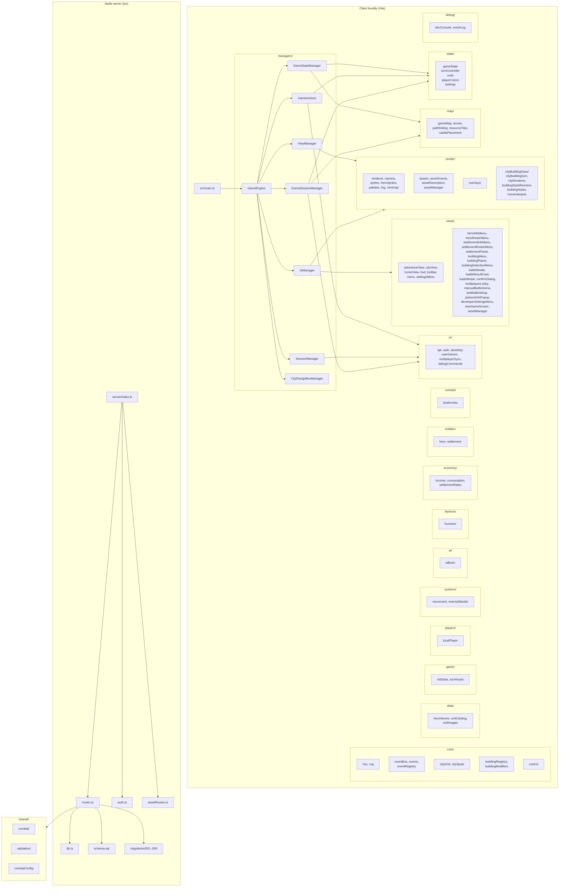
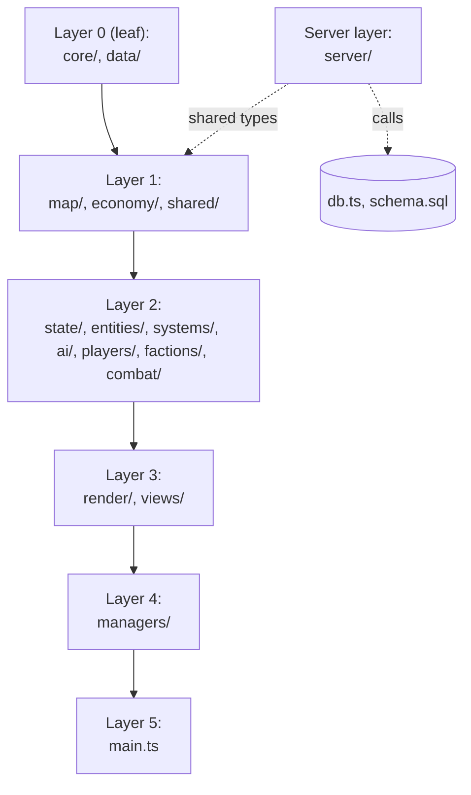

# heroes-js — Software Architecture Plan: Module Organization & Future Expansion

*Authored 2026-08-09. Companion to `docs/architecture.md` (the executed plan that established today's `src/` shape) and `plan/2026-08-09-bloat-scalability-review.md` (the bloat-prevention review). This doc is forward-looking: it states the **current** module organization, then lays out the **expansion slots** and **future-module candidates** the codebase will need.*

---

## 1. Why this doc exists

The repo today has three forces pulling it in different directions:

1. `docs/architecture.md` (executed plan, locked) defines `src/` in 7 subdirs that map to game-design domains.
2. Real growth — home view, auth, multiplayer lobby, dev console, event bus, city view — has already added modules that aren't in that 7-dir map.
3. Deferred features (army, food/upkeep, fog of war, tactical combat, real email delivery, replay) all need their own slots.

This plan harmonizes 1 and 2 by extending the map, and pre-decides slots for 3 so the next feature lands in an obvious place. It's a **target shape**, not a refactor mandate — adopt it incrementally as features land.

---

## 2. Module organization — the current shape, audited



### 2.1 What each layer is responsible for today

| Layer | Responsibility | Modules |
|---|---|---|
| **Entry** | Boot, wire everything, rAF loop | `src/main.ts` |
| **Managers** | Long-lived orchestrators that own infrastructure and delegate work | `managers/GameEngine.ts`, `GameStateManager.ts`, `ViewManager.ts`, `UIManager.ts`, `GameActions.ts`, `SessionManager.ts`, `GameSessionManager.ts`, `CityDesignBoxManager.ts` |
| **State** | Pure-ish domain state + reducers | `state/gameState.ts`, `turnController.ts`, `units.ts`, `playerColors.ts`, `settings.ts` |
| **Core** | Pure math, types, no game-domain knowledge | `core/hex.ts`, `rng.ts`, `eventBus.ts`, `events.ts`, `eventRegistry.ts`, `cityGrid.ts`, `citySpots.ts`, `buildingRegistry.ts`, `buildingModifiers.ts`, `control.ts` |
| **Map** | The world: terrain, traversal, resource placement | `map/gameMap.ts`, `terrain.ts`, `pathfinding.ts`, `resourceTiles.ts`, `castlePlacement.ts` |
| **Render** | Drawing to the canvas | `render/renderer.ts`, `camera.ts`, `sprites.ts`, `heroSprites.ts`, `palettes.ts`, `fog.ts`, `minimap.ts`, `assets.ts`, `assetSource.ts`, `assetDescriptors.ts`, `cityBuildingDraw.ts`, `cityBuildingGen.ts`, `cityRenderer.ts`, `buildingStyleResolver.ts`, `buildingStyles.ts`, `horseVariants.ts`, `overlays/*` |
| **Views** | DOM UI (HUD, menus, modals, screens) | `views/*` (25+ files — see §2.2) |
| **IO** | Wire to the outside world (HTTP, storage, debug) | `io/api.ts`, `auth.ts`, `assetApi.ts`, `userGames.ts`, `multiplayerSync.ts`, `debugCommands.ts` |
| **Data** | Static catalogs | `data/heroNames.ts`, `unitCatalog.ts`, `unitImages.ts` |
| **Game** | Lifecycle glue (init, turn hooks) | `game/initState.ts`, `turnHooks.ts` |
| **Players** | Local-vs-remote player bookkeeping | `players/localPlayer.ts`, `factions/humans/*` |
| **Systems** | Per-tick behavior | `systems/movement.ts`, `enemyWander.ts` |
| **AI** | Decision making | `ai/aiBrain.ts` |
| **Economy** | Per-turn math | `economy/income.ts`, `consumption.ts`, `settlementRates.ts` |
| **Entities** | Domain objects (kept thin) | `entities/hero.ts`, `settlement.ts` |
| **Combat** | Combat-specific helpers | `combat/testArmies.ts` |
| **Debug** | Dev-time introspection | `debug/devConsole.ts`, `eventLog.ts` |
| **Server** | HTTP surface + schema + migrations | `server/index.ts`, `routes.ts`, `auth.ts`, `assetRoutes.ts`, `db.ts`, `schema.sql`, `migrations/*` |
| **Shared** | Code used by both client and server | `shared/combat/`, `shared/validation/`, `shared/combatConfig.ts` |

### 2.2 The "views" folder is already a sprawl

There are 25+ files under `src/views/` and counting (`homeView`, `newGameScreen`, `multiplayerLobby`, `settingsMenu`, `developerSettingsMenu`, `heroInfoMenu`, `heroRosterMenu`, `settlementInfoMenu`, `settlementRosterMenu`, `settlementPanel`, `buildingMenu`, `buildingPlacer`, `buildingSelectionMenu`, `battleModal`, `battleResultCard`, `manualBattleArena`, `testBattleSetup`, `tradeModal`, `platoonInfoPopup`, `confirmDialog`, `assetManager`, plus the always-present `hud.ts`, `toolbar.ts`, `menu.ts`, `adventureView.ts`, `cityView.ts`). The next feature will add 1–3 more. See §4.4 for the proposed split.

### 2.3 The "render" folder is also sprawling

`src/render/` has 17+ files. The sub-folder `overlays/` is the only sub-grouping. `cityBuildingDraw/` exists but `cityBuildingGen.ts`, `cityRenderer.ts`, `cityBuildingDraw.ts`, `buildingStyles.ts`, `buildingStyleResolver.ts`, `horseVariants.ts` all sit flat at the `render/` level. This is workable today; see §4.5 for a future grouping.

---

## 3. Dependency rules (the actual contract)

These are the rules the current code follows *informally*. This plan promotes them to **policy**.



Rules, in plain English:

- **`core/` is leaf-only.** Nothing in `core/` imports from anywhere except other `core/` modules and pure Node/Vite types. Today: `hex.ts`, `rng.ts`, `eventBus.ts`, `events.ts`, `eventRegistry.ts`, `control.ts`. Some `core/` files (`cityGrid.ts`, `citySpots.ts`, `buildingRegistry.ts`, `buildingModifiers.ts`) currently import nothing from outside `core/`, but live there because they're "pure data + math". Keep this discipline.
- **`map/` and `shared/` may depend on `core/` only.** Plus other `map/` and `shared/` modules. Plus `data/`.
- **`state/`, `entities/`, `systems/`, `ai/`, `economy/`, `players/`, `factions/`, `combat/`** may depend on `core/`, `map/`, `shared/`, `data/`, and their own layer. Not on `render/` or `views/`.
- **`render/` may depend on everything except `managers/`, `views/`, `io/`** (other than the asset-fetching subset of `io/assetApi.ts`). The render layer draws the world; it shouldn't know about UI state.
- **`views/` may depend on `render/`, `state/`, `core/`, `io/`, `data/`.** Views consume state and present it; they don't mutate it directly.
- **`managers/` may depend on everything.** That's its job.
- **`server/` is a separate process** but reuses `shared/`. The server **must not** import from `src/` (see §6.1 — already a known smell).
- **No barrel files (`index.ts`).** Imports are explicit. This was a non-goal in `docs/architecture.md` and the codebase has kept it; preserve it.

---

## 4. Expansion plan — future modules

Each subsection describes a feature that's either already deferred (`docs/README.md`) or strongly implied by current code, and the slots it should fill. The order is roughly "what lands first".

### 4.1 Fog of war — `src/systems/fogOfWar.ts` + `src/render/fog.ts` (expand)

**Today.** `src/render/fog.ts` exists but is unused. `docs/map.md` lists fog of war as deferred.

**Plan.**
- `systems/fogOfWar.ts` — pure logic. Given `GameState`, `MapSize`, `players`, `revealedTiles`, compute `visibleTiles` per player (axial coords).
- `render/fog.ts` — already exists; expand to take `visibleTiles`, `revealedTiles`, and a player id. Draw fog of war over the adventure map.
- `state/gameState.ts` — add `revealedTiles: Record<playerId, Set<axialKey>>` to the state shape.
- `server/routes.ts` — `PATCH /games/:name` already accepts state patches; the new field rides that.
- `server/migrations/009_fog_of_war.sql` — optional `games.fog_revealed JSONB DEFAULT '{}'::jsonb` if the structured path (§R1 in the bloat review) hasn't been adopted.

**Why this slot.** Fog of war is a `systems/` task (pure transformation of state) with a `render/` task (visualization). Keeping it split from `render/fog.ts` ensures the renderer doesn't run the rules — it just draws them.

### 4.2 Army + food/upkeep — `src/state/army.ts` + `src/systems/upkeep.ts` + `src/economy/consumption.ts` (expand) + `src/data/unitCatalog.ts` (expand)

**Today.** `state/units.ts` defines `Platoon`, `UnitType`. `data/unitCatalog.ts` catalogs unit types. `economy/consumption.ts` exists. `docs/army.md` is the design doc.

**Plan.**
- `state/army.ts` (new) — the `Army` reducer and per-hero army state (split out of `state/gameState.ts`).
- `systems/upkeep.ts` (new) — daily tick: pay gold/food for each platoon, disband empty.
- `economy/consumption.ts` (expand) — settlement-level food consumption alongside hero food consumption.
- `combat/` — promotion of `combat/testArmies.ts` into a real `combat/resolve.ts` and `combat/types.ts`. The shared reducer `shared/combat/resolveBattle` already exists.
- `server/migrations/009_army.sql` — `army` table (one row per hero) if §R1 (de-JSONB) was adopted; otherwise rides inside `games.heroes` JSONB.

**Why this slot.** Army + food are the biggest deferred subsystem. Splitting them now (`state/army.ts` separate from `state/gameState.ts`) prevents `gameState.ts` from growing past the point where any change requires reading 2000+ lines.

### 4.3 Tactical combat — `src/views/battleView.ts` + `src/render/battleRenderer.ts` + `src/systems/battle.ts`

**Today.** Auto-resolve only (`POST /games/:name/resolve-battle`). Tactical battlefield is deferred.

**Plan.**
- `views/battleView.ts` (new) — full-screen battle overlay, hexagonal battlefield, turn-by-turn animation. Reuses `render/camera.ts`, `render/palettes.ts`.
- `render/battleRenderer.ts` (new) — separate from `render/renderer.ts` (adventure map) because the coordinate system is different (different `HEX_SIZE`, different camera bounds, different overlays).
- `systems/battle.ts` (new) — battle tick loop: initiative, per-round resolution, retreat checks.
- `shared/combat/` (expand) — add `BattlePhase`, `BattleAction`, `BattleEvent` types. The resolver already exists; these types make the state machine explicit.

**Why this slot.** Tactical combat is the largest single feature after army. Splitting the renderer and the view from the adventure map's renderer keeps the per-frame cost from doubling for every player who isn't in combat.

### 4.4 View layer split — `src/views/` → `src/views/<screen>/`

**Today.** 25+ files flat under `views/`.

**Plan.** Reorganize by **screen** rather than by **DOM kind**:

```
src/views/
  shared/
    menu.ts
    confirmDialog.ts
    settingsMenu.ts
    developerSettingsMenu.ts
    hud.ts
    toolbar.ts
  home/
    homeView.ts
    newGameScreen.ts
    assetManager.ts
  adventure/
    adventureView.ts
    battleResultCard.ts
  city/
    cityView.ts
    buildingMenu.ts
    buildingPlacer.ts
    buildingSelectionMenu.ts
    settlementInfoMenu.ts
    settlementRosterMenu.ts
    settlementPanel.ts
  heroes/
    heroInfoMenu.ts
    heroRosterMenu.ts
    platoonInfoPopup.ts
  combat/
    battleModal.ts
    manualBattleArena.ts
    testBattleSetup.ts
  multiplayer/
    multiplayerLobby.ts
  trade/
    tradeModal.ts
```

This is a **mechanical** refactor (no behavior change) — the right time to do it is the next time more than ~3 view files are touched for a feature. Until then, leave flat.

**Why this slot.** New views are added every feature. The current flat layout is findable today because of good file names, but at 40+ files it stops being so. Splitting by screen gives every feature a place to land that doesn't crowd other features.

### 4.5 Render layer grouping — `src/render/<surface>/`

**Today.** `render/` is flat except for `overlays/` and `cityBuildingDraw/`.

**Plan.** Once tactical combat (§4.3) lands, group by **what is being drawn**:

```
src/render/
  shared/
    camera.ts
    palettes.ts
    horseVariants.ts
    fog.ts
  adventure/
    renderer.ts
    sprites.ts
    heroSprites.ts
    minimap.ts
    overlays/
  city/
    cityRenderer.ts
    cityBuildingDraw.ts
    cityBuildingGen.ts
    buildingStyles.ts
    buildingStyleResolver.ts
    cityBuildingDraw/
  battle/
    battleRenderer.ts
  assets/
    assets.ts
    assetSource.ts
    assetDescriptors.ts
```

**Why this slot.** Renderers evolve independently (adventure, city, battle each need different zoom, fog, palette). Grouping by surface makes it obvious where a new drawing helper belongs and prevents "one render helper that draws for all surfaces" from re-emerging.

### 4.6 Multiplayer realtime layer — `src/io/ws.ts` + `server/ws.ts` + `src/systems/multiplayerTick.ts`

**Today.** `WS_PORT=4100` is reserved in `scripts/ports.ps1`. Nothing uses it. `io/multiplayerSync.ts` exists for HTTP-based polling.

**Plan.**
- `src/io/ws.ts` (new) — typed websocket client. Subscribes to `server/ws.ts`. Reuses types from `shared/api/`.
- `server/ws.ts` (new) — Node `ws` server, attached to the existing Express process via `server.on('upgrade', ...)`. Authentication via the existing `user_sessions` bearer token.
- `src/systems/multiplayerTick.ts` (new) — client-side handler: receive diff, apply reducer, re-render.
- `server/wsBroadcast.ts` (new) — server-side: when `withTransaction` commits in any of the existing routes, push the diff to subscribers.

**Why this slot.** Multiplayer over HTTP polling works at 1 player per turn but won't scale to 4 players in real time. Adding the websocket now — even if only used for "your turn" notifications at first — gives the project a place to land realtime features without touching the rest of the architecture.

### 4.7 Replay / observability — `src/io/replay.ts` + `server/replay.ts` + `src/debug/replayViewer.ts`

**Today.** `game_events` is written but only consumed for `validate` and the dev console.

**Plan.**
- `src/io/replay.ts` (new) — given a `gameId`, fetch `game_events` and replay them through the reducer pipeline to rebuild the in-memory state.
- `server/replay.ts` (new) — `GET /api/games/:name/replay?from=eventId` — server-side incremental replay.
- `src/debug/replayViewer.ts` (new) — in dev console, scrub through events.

**Why this slot.** Replay falls out of the existing `game_events` table for free if the events carry enough state. Recording becomes a feature ("share this match"), debugging becomes "step through the event log", and AI training data extraction becomes "give me the events for game X". No new schema needed — just consumers.

### 4.8 Modding / content packs — `src/data/packs/` + `src/loaders/packLoader.ts`

**Today.** Content is hard-coded in `data/unitCatalog.ts`, `data/heroNames.ts`, `data/unitImages.ts`, `render/buildingStyles.ts`. `server/migrations/002_unit_types.sql` etc. seed the DB.

**Plan.**
- `src/data/packs/` (new) — content packs as plain JSON: `{ units: [...], heroes: [...], buildings: [...], tiles: [...] }`. Each pack is a folder under `src/data/packs/`.
- `src/loaders/packLoader.ts` (new) — pure function: takes a pack object, returns merged `UnitCatalog` + `BuildingStyle[]` + `HeroName[]`.
- `server/packs.ts` (new) — same loader on the server; validates pack contents; rejects on schema mismatch.
- `src/views/settingsMenu.ts` (expand) — add a "Content Packs" section that lets the user pick which packs are active.

**Why this slot.** Modding is the cheapest form of "the game keeps being fun after the original content is exhausted". Locking in the loader pattern now (one pack = one folder = one JSON file) prevents the catalog files from being the only way to add a unit or a hero later.

### 4.9 Asset CDN / versioning — `src/render/assetsV2.ts` (replaces `assets.ts`) + `src/io/assetVersion.ts`

**Today.** `render/assets.ts`, `render/assetSource.ts`, `render/assetDescriptors.ts` load baked-in PNGs from `src/resources/`. The server has `server/assetRoutes.ts` for upload/download.

**Plan.**
- `src/render/assetVersion.ts` (new) — a small manifest `{ version, sprites: [{ key, hash, url }] }` so the client knows what assets exist and which hash it's looking at.
- `src/render/assetsV2.ts` (new, replaces `assets.ts`) — loads from the manifest, falls back to baked-in if offline.
- `src/io/assetApi.ts` (expand) — `fetchManifest()` reads the manifest from the server.
- `server/assetManifest.ts` (new) — builds the manifest from the `game_assets` table on every server boot (or on demand).

**Why this slot.** Once you start sharing the DB across machines (§1 of `plan/2026-08-09-architecture-walkthrough-tailscale.md`), you'll want different sprite bundles per machine. Versioning assets gives you that without rebuilding the client every time.

### 4.10 Scripted scenarios — `src/script/` (entirely new layer)

**Today.** None. Everything is RNG-seeded.

**Plan.**
- `src/script/` (new) — a tiny scripting language or a JSON DSL for "do X, then Y, then end the turn". One scenario = one `.scenario.json` file.
- `src/script/runner.ts` (new) — interprets a scenario against the existing reducer pipeline.
- `src/script/scenarios/` (new) — bundled scenarios (e.g. "tutorial 1: capture a resource tile").
- `src/views/newGameScreen.ts` (expand) — "Start from scenario" picker.

**Why this slot.** Scripted scenarios = tutorial = onboarding = retention. The script runner, being a pure function over the existing reducer pipeline, is cheap to add and unlocks all of the above.

---

## 5. Convention checklist (apply going forward)

These are conventions the codebase already follows. Promoting them to a checklist makes it easy to review new PRs against.

- [ ] **No barrel files.** No `index.ts` that re-exports from a folder.
- [ ] **No comments in code** unless the user asked. (AGENTS.md rule; doc files are fine.)
- [ ] **Strict TypeScript.** No `any` unless justified; prefer named exports; type-only imports use `import type`.
- [ ] **Pure functions at the bottom of the stack.** Reducers and tick systems take state in, return state out.
- [ ] **One domain concept per file.** If a file describes two concepts, split.
- [ ] **Wire types live in `shared/`.** Anything crossing the client/server boundary is defined once in `shared/` and imported by both.
- [ ] **`core/` is leaf-only.** `core/` files never import from `state/`, `render/`, `views/`, `managers/`, or `server/`.
- [ ] **Long-lived objects live in `managers/`.** Things with lifetimes (canvas, controllers, sessions, event log) belong in `managers/`.
- [ ] **DOM UI lives in `views/`.** Anything that creates or mutates DOM lives there.
- [ ] **Canvas drawing lives in `render/`.** Anything that draws to canvas lives there.
- [ ] **Per-tick mutations live in `systems/` or in reducers in `state/`.** No mutation in `views/` or `render/`.
- [ ] **DB access lives in `server/` (or `shared/` for the helpers, never in `src/`).** No `pg` imports outside `server/`.
- [ ] **No new top-level dirs without updating this doc.** If a feature needs a new layer (e.g. `script/`), add it here first.

---

## 6. Known architectural smells (carry-over from the bloat review)

These are not part of the expansion plan, but every new feature should be designed against them so we don't grow new ones.

1. **`server/routes.ts` imports types from `src/state/`.** The server depends on the client bundle's source tree. *Fix:* move domain types to `shared/state/` and `shared/combat/` (review §R6 in the bloat review).
2. **`games` row is a JSONB document store with structured columns.** Two sources of truth. *Fix:* deprecate the JSONB writes (review §R1 in the bloat review).
3. **`initSchema()` runs every boot and isn't concurrency-safe.** Fine for one API process; breaks under multi-API. *Fix:* advisory lock + `schema_migrations` table (review §R2, §R3 in the bloat review).
4. **`lobby` lives in JSONB inside `games`.** Should be a table. *Fix:* new migration + new routes (review §R7 in the bloat review).
5. **`applyEndOfTurnDetailed` is buried inside a route handler.** Should be a service. *Fix:* extract to `shared/turns/` (review §R9 in the bloat review).
6. **Port allocator is platform-specific PowerShell.** *Fix:* 30-line Node equivalent (review §R14 in the bloat review).

Every §4 feature should design around these smells, not perpetuate them. Specifically:

- New endpoints added under §4.6 and §4.7 should consume typed `shared/api/` contracts (§R5 in the bloat review).
- New state under §4.1, §4.2 should land in **structured** tables where possible (avoid new JSONB columns unless absolutely necessary).

---

## 7. Migration strategy

This plan is forward-looking. Existing code does not need to be refactored to match it. The migration rule is:

> **A module moves to its new home when it next gets a non-trivial edit. A new module lands in its planned home from day one.**

Concretely:

- When fog of war (§4.1) ships, the new `systems/fogOfWar.ts` lands in `src/systems/`. The existing `render/fog.ts` stays where it is and gets expanded in place. The `revealedTiles` field in state goes through the existing `PATCH /games/:name` reducer path.
- When tactical combat (§4.3) ships, `views/battleView.ts`, `render/battleRenderer.ts`, `systems/battle.ts` land in their new homes. The auto-resolve route in `server/routes.ts` is unchanged.
- When view files start crowding (§4.4), the next screen-scoped folder (`views/multiplayer/`) is created; existing flat files migrate as they're touched.
- When `src/script/` (§4.10) ships, it's a brand-new layer. Nothing existing moves.

The plan is allowed to drift; this doc is the reference, but the code is the truth. When code drifts, update this doc in the same PR.

---

## 8. See also

- `docs/architecture.md` — the executed plan that established `src/` in 7 subdirs. This doc is its forward-looking extension.
- `plan/2026-08-09-bloat-scalability-review.md` — the bloat-prevention review (R1–R20). This doc's §6 cross-references it.
- `plan/2026-08-09-architecture-walkthrough-tailscale.md` — the architecture walkthrough + Tailscale plan.
- `docs/README.md` — locked decisions and deferred-features list. Every §4 entry here should also have an entry there (status: 📋 Planned).
- `docs/army.md`, `docs/map.md`, `docs/city-view-impl-plan.md`, `docs/event-system.md`, `docs/dev-console.md` — design docs that the expansion modules will implement.
- `TECHNICAL_SPECIFICATIONS.MD` — the canonical tech-stack reference.
- `AGENTS.md` — coding constraints. Every recommendation in this plan is compatible with those constraints.
