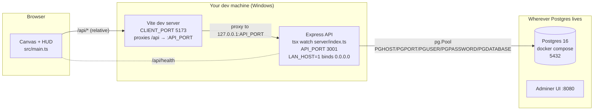
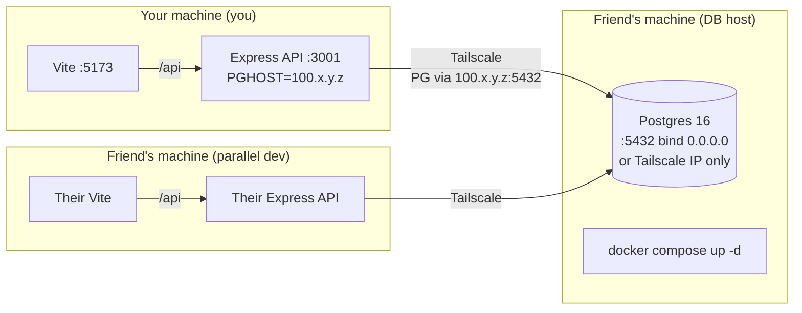

# heroes-js — Architecture Walkthrough & Tailscale Plan

*Review date: 2026-08-09. Companion to `TECHNICAL_SPECIFICATIONS.MD`; this doc focuses on how the three processes fit together and what changes when the DB moves off-machine.*

## 1. What you actually have

Three processes, all started by `npm`:



Key facts from the code:

- **Client (browser)**: Vite SPA built from `src/main.ts`, no React/Vue. It calls **relative** `/api/...` URLs. The proxy lives in `vite.config.ts` and rewrites `/api` → `http://127.0.0.1:${API_PORT}`. There is **no** API base URL configurable from the client.
- **API (Node)**: `server/index.ts` boots Express on `process.env.API_PORT ?? 3001`. Bound to `127.0.0.1` unless `LAN_HOST=1`, in which case `0.0.0.0`. Mounts `/api/*` from `server/routes.ts`, plus `/api/assets` and `/api/auth` sub-routers.
- **DB (Postgres 16 Alpine)**: `docker-compose.yml` defines two services — `db` (Postgres on host port `5432`, named volume `game_db_data`) and `adminer` (DB UI on `8080`). Credentials `gameuser` / `gamepass` / database `game_poc`. The `db` container has `restart: unless-stopped` and a healthcheck via `pg_isready`.
- **Connection**: `server/db.ts` reads `PGHOST` (default `localhost`), `PGPORT` (default `5432`), `PGUSER`, `PGPASSWORD`, `PGDATABASE`. The comment in `db.ts` is explicit: the DB runs in a **single shared docker-compose container on a fixed host port 5432**, so per-worktree `DB_PORT` from `scripts/ports.ps1` is intentionally **not** read.
- **Schema bootstrap**: every API start runs `initSchema()` which `CREATE TABLE IF NOT EXISTS`/`ALTER TABLE ADD COLUMN IF NOT EXISTS` from `server/schema.sql`, then applies migrations `001…008` from `server/migrations/`. Re-applying on every boot is safe because everything is idempotent, but it also means **schema changes land by editing the SQL files and restarting the API**.
- **Port allocator**: `scripts/ports.ps1` writes `CLIENT_PORT`, `API_PORT`, `WS_PORT`, `REDIS_PORT` to `.env` (dynamic free-port or deterministic `--static`). It does **not** write `PGHOST`/`PGPORT`. This is why your `.env.example` only has `LAN_HOST`.

## 2. How npm wires it up

| Script | What runs | Ports involved |
|---|---|---|
| `predev` | `cleanup.ps1` then `ports.ps1` | frees stale procs, writes `.env` |
| `dev` | `concurrently "vite"` + `tsx watch --env-file=.env server/index.ts` | `CLIENT_PORT`, `API_PORT` |
| `dev:web` / `dev:api` | only one of the two | split for debugging |
| `dev:static` | same as `dev` but with `--static` ports (stable per worktree) | hash-derived from worktree path |
| `db:up` / `db:down` | `docker compose up -d` / `down` | fixed `5432`, `8080` |
| `dev:status` | `dev-status.ps1` — healthchecks each port, hits `/api/health`, inspects `game_db` container status | n/a |
| `pretest*`, `test*` | allocate ports, then `tsx test/*.ts` (Playwright + `pg` smoke) | same `CLIENT_PORT`/`API_PORT` |
| `build` | `tsc && vite build` (tsc is typecheck only, `noEmit:true`) | n/a |

Two things worth noticing because they cause real foot-guns:

1. **`scripts/ports.ps1` writes to `.env`**, but the DB connection reads from `process.env.PGHOST`/`PGPORT`. Today those defaults are `localhost`/`5432`. If you ever set `PGHOST` in your shell and forget it's stale, you'll connect to a different DB than you expect. Worth standardizing.
2. **`server/db.ts` ignores `DB_PORT`** but `scripts/cleanup.ps1` and `dev-status.ps1` still parse `DB_PORT` from `.env`. That's harmless dead config, but it's the kind of leftover that will confuse a future contributor.

## 3. Things that look "vibe-coded too hard"

These are observations, not prescriptions.

- **The DB is a JSON document store with a Postgres header.** `games` carries `enemy_positions JSONB`, `players JSONB`, `heroes JSONB`, `settlements JSONB`, `lobby JSONB`. Per-turn snapshots, resource transactions, etc. live in dedicated tables (`game_events`, `settlement_snapshots`, `resource_transactions`, `tiles`, `unit_types`, `auth_codes`, `user_sessions`). It's a hybrid: structured metadata + a JSON-blob snapshot of game state. That works for a small project, but it means you have **two sources of truth for some facts** (e.g. `games.round`/`games.day` and the JSON inside `games.settlements`). When the JSON drifts from the structured columns you'll get bugs that are hard to reproduce.
- **`applyEndOfTurnDetailed` runs on the server inside `POST /games/:name/end-turn`.** That's good (server is authoritative), but it imports the reducer from `src/state/gameState.ts` — the API and the client share **the same reducer code**, which is great for consistency, but it also means any reducer change ships to both the client bundle and the API simultaneously. Good discipline, easy to break by accident.
- **`POST /api/games` regenerates the world map from the seed on every save.** It builds a fresh `GameMap(seed, mapSize)` and bulk-inserts tiles. That's why `map_size` is stored in the row — it's the parameter the server uses to recreate the map for `GET /games/:name/tiles` when the tile table is empty. Smart, but: if you ever store data that depends on which map algorithm was current, you'll have to add a `schema_version` column.
- **`UPDATE games` on `POST /games` is upsert-by-name.** This silently overwrites an existing game's state when someone reuses a name. Convenient for dev, dangerous in prod.
- **CORS is wide open** (`app.use(cors())` with no allowlist) and there is no auth on `/api/games` reads — any LAN guest can read any save. Fine for LAN/Tailscale-with-friends; not fine for anything public.
- **Game-state validation lives in a separate file** (`shared/validation/gameIntegrity.ts`) and is exposed at `GET /games/:name/validate` — that's a nice pattern.
- **`scripts/ports.ps1` reserves `WS_PORT=4100`** for a future realtime layer but nothing in the codebase uses it today. Dormant.

## 4. The Tailscale plan — moving the DB to your friend's place

Goal: both of you hit the same Postgres from your own dev machines, but only one of you runs the container.

### Recommended topology



### Concrete recipe

**On the DB host (your friend's box):**

1. Install Tailscale, authenticate with the same tailnet.
2. Edit `docker-compose.yml`:
   - **Don't expose `5432:5432` on `0.0.0.0`**. Change the host port mapping to bind only to the Tailscale interface, or use `expose:` instead of `ports:` and let Tailscale carry it. Simplest cross-platform change:
     ```yaml
     ports:
       - "127.0.0.1:5432:5432"   # not reachable from outside the host
     ```
     Then expose Postgres to the tailnet via one of:
     - **Tailscale node sharing** and an SSH/TCP-tunnel from your side, OR
     - **Run Postgres on the host directly** (without docker) bound to its Tailscale IP, OR
     - **`tailscale serve tcp://5432`** — the friend runs this and Tailscale proxies it. You connect to `<friend-tailnet-hostname>:5432`.
   - **Use a real password** for cross-machine dev. Put it in `.env` on the host (not committed) and have `POSTGRES_PASSWORD` read from env.
   - **Don't `db:down` it.** It's now the shared DB, not local-only. `AGENTS.md` already says this for shared worktrees, but the rule is doubly important across machines.
3. Note the friend's Tailscale hostname or `100.x.y.z` IP.

**On your dev machine (no code changes required):**

1. Install Tailscale, join the same tailnet.
2. Set `PGHOST` in your `.env` to your friend's tailnet address. `.env` is gitignored, so this is safe:
   ```env
   LAN_HOST=0
   PGHOST=jacobs-mac.tail-xxxx.ts.net
   PGPORT=5432
   PGUSER=gameuser
   PGPASSWORD=the-shared-password
   PGDATABASE=game_poc
   ```
3. `npm run dev` as normal. The API dials Postgres over Tailscale.
4. Optional: add a `psql` smoke check in the `predev` hook so you find out at startup if the tunnel is down instead of mid-save.

### Watch-outs

- **`server/db.ts` reads `PGHOST` from process env via `tsx --env-file=.env`.** That's already in place — no code changes needed. But `scripts/dev-status.ps1` checks the **container name** (`game_db`), which will be missing on your machine. Replace it with `pg_isready -h "$PGHOST" -p "$PGPORT" -U "$PGUSER"` so it works on every machine in the tailnet.
- **CORS** is wide open (`app.use(cors())`). Fine for tailnet dev; tighten before any public exposure.
- **LAN multiplayer (`LAN_HOST=1`)**: this binds the API to `0.0.0.0` so your friend can hit **your** API. With a shared DB you can either (a) both run your own API pointed at the shared DB, or (b) one of you runs the API and the other just connects to it. Both work; (a) is closer to your current setup. Pick one and document it in `AGENTS.md`.
- **Schema migrations are auto-applied on API boot.** That's fine when you're the only writer. With two of you restarting the API against the same DB, two concurrent `initSchema()` calls happen. Everything is currently idempotent (`IF NOT EXISTS`, `ADD COLUMN IF NOT EXISTS`), so it's safe today, but it's a footgun the moment someone writes a non-idempotent migration. Wrap `initSchema()` in a `pg_try_advisory_lock` before applying migrations.
- **Backups**: `game_db_data` is a Docker volume on your friend's box. Add a scheduled `pg_dump` before this becomes the source of truth. Tailscale doesn't back up your data.
- **Latency**: every action makes a round-trip to your friend's house. Tailscale is sub-50ms typical, fine for game actions, but `npm run test:all` exercises these in a tight loop. Run CI from the DB host; let your machine be a regression check.

### Optional hardening

1. **`scripts/dev-status.ps1`**: replace the `docker ps | grep game_db` check with `pg_isready -h "$PGHOST" -p "$PGPORT" -U "$PGUSER"`.
2. **`server/db.ts`**: wrap `initSchema()` in `pg_advisory_xact_lock(hashtext('heroes-js-schema'))` so concurrent boots can't race on a future non-idempotent migration.
3. **`.env.example`**: add `PGHOST=localhost`, `PGPORT=5432`, `PGUSER=gameuser`, `PGPASSWORD=gamepass`, `PGDATABASE=game_poc` with comments pointing at the Tailscale plan.
4. **`AGENTS.md`** or a new `plan/tailscale-db.md`: document the `tailscale serve tcp://5432` command and which `.env` keys to set.
5. **`docker-compose.yml`**: switch the `db` host port from `"5432:5432"` to `"127.0.0.1:5432:5432"`. Tailscale serves it explicitly; the LAN stays closed.
6. **`package.json`**: add `db:ping` (`tsx -e "import {pool} from './server/db.ts'; pool.query('SELECT 1').then(()=>process.exit(0))"`) so `predev` can short-circuit if the DB is unreachable.

## 5. TL;DR

- Clean three-process stack: Vite (browser), Express (Node), Postgres (Docker). All orchestrated by `npm run dev`/`db:up` and gated by the `predev` hook.
- The DB connection is already env-driven (`PGHOST`/`PGPORT`/`PGUSER`/`PGPASSWORD`/`PGDATABASE`), so moving Postgres over Tailscale is **a `.env` change on your side and a `tailscale serve tcp://5432` on theirs** — no code edits required.
- The two real follow-ups before this becomes your daily driver: (1) make `initSchema()` concurrency-safe for two-API boots, and (2) put a backup story on the friend's box. Both small.
- The "JSON-in-Postgres" smell is fine for now; the bigger smell is the dual source of truth (`games.round`/`games.day` vs the JSON inside `games`). Worth a one-time cleanup pass when you next touch that table, but not blocking the Tailscale move.
